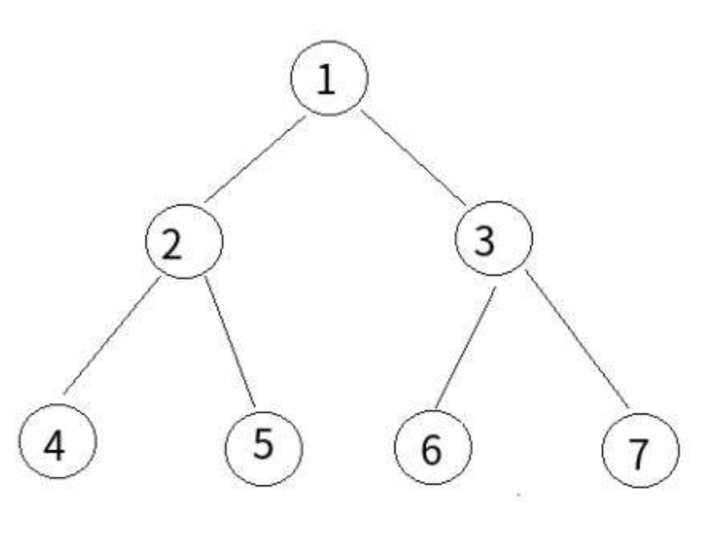

### 中序遍历



- 递归输出：1,2,4,4,4,2,5,5,5,2,1,3,6,6,6,3,7,7,7,3,1
- 中序遍历(左，头，右)：4,2,5,1,6,3,7
- 递归式
  - 也就是数字第二次出现的地方

```js
let inorderTraversal = function(root) {
  let list = []
  function middleOrder(node) {
    if (node !== null) {
      if (node.left) middleOrder(node.left)
      list.push(node.val)
      if (node.right) middleOrder(node.right)
    }
  }
  middleOrder(root)
  return list
}
```

- 非递归
  - 声明一个栈
  - 将整棵树放入栈中，再将树的左边界全部 push 到栈中
  - 如果没有边界了，就弹出(pop),push 到输出中
  - 再去右边界上找左边界，循环

```js
let inorderTraversal = function(root) {
  let list = []
  let stack = []
  let node = root
  while (stack.length || node) {
    while (node) {
      // 不停的将左边界放到栈中
      stack.push(node)
      node = node.left
    }
    // 如果没有边界，弹出
    node = stack.pop()
    list.push(node.val)
    // 将右边界等于node，再去走while循环，继续找左边界
    node = node.right
  }
  return list
}
```
