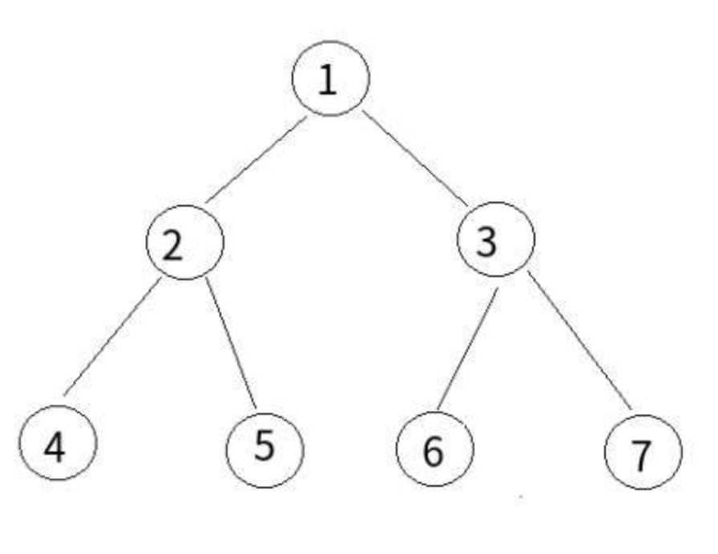

### 后序遍历



- 递归输出：1,2,4,4,4,2,5,5,5,2,1,3,6,6,6,3,7,7,7,3,1
- 后序遍历(左,右,头)：4,5,2,6,7,3,1
- 递归式
  - 也就是数字第三次出现的地方

```js
let postorderTraversal = function(root) {
  let list = []
  function postOrder(node) {
    if (node !== null) {
      if (node.left) postOrder(node.left)
      if (node.right) postOrder(node.right)
      list.push(node.val)
    }
  }
  postOrder(root)
  return list
}
```

- 非递归
  - 声明一个栈
  - 将根节点 push 栈中
  - 从栈中弹出 pop 记为 node，unshift 结果中
  - 先 node 左，在 node 右
  - 添加栈中
  - 循环

```js
let postorderTraversal = function(root) {
  let list = []
  let stack = []
  if (root) stack.push(root)
  while (stack.length > 0) {
    let node = stack.pop()
    list.unshift(node.val)
    if (node.left) stack.push(node.left)
    if (node.right) stack.push(node.right)
  }
  return list
}
```
