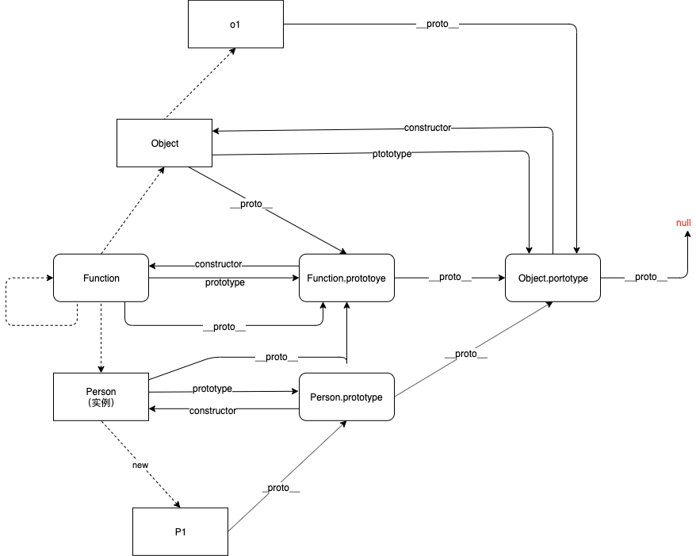
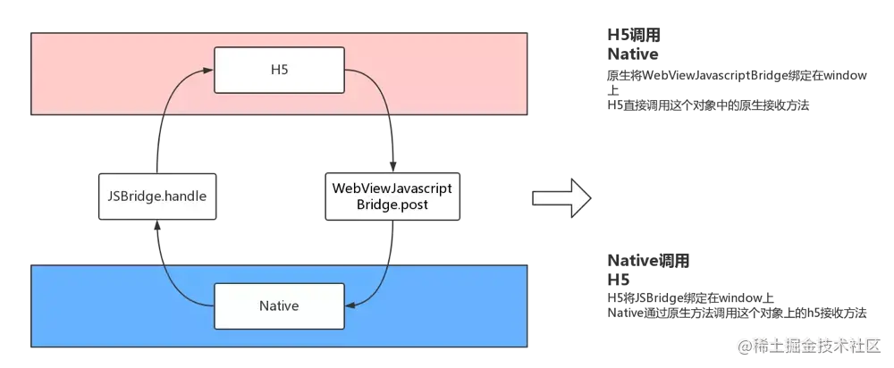

## 1. let，const，var区别
  - var 存在变量提升，挂载在window上，没有块级作用域
  - let，const有块级作用域的概念，作用域外面访问不到，不会变量提升，不会挂载window上
  - const生命的常量，不能修改，只能在会计作用域内访问

## 2. this指向
  - 默认指定是window
  - setTimeout，setInterval中的this指向window
  - 对象中指的是调用的这个对象
  - 可以通过call和apply进行修改this指定
  - new声明构造函数，this指向new 声明的对象
  - 箭头函数没有this，指定的外层父级，外层作用域决定的
  - 题目1
  ```js
  let a = 10
  const b = 20
  function foo () {
    console.log(this.a)  // undefined
    console.log(this.b)  // undefined
  }
  foo();
  console.log(window.a) // undefined 

  // foo去调用默认是指向window，但是a使用let声明，不会将a挂载到window上，所以打印都是undefined 
  ```

  - 题目2
  ```js
  var a = 1
  function foo () {
    var a = 2
    console.log(this)  // window
    console.log(this.a) // 1
  }
  foo() 

  // foo是window进行调用的，所以这时候的this指向的是window，
  // 因为a是用var声明，是挂载在window上，所以打印的this.a的值是1
  ```
  - 题目3
  ```js
    var obj2 = {
      a: 2,
      foo1: function () {
        console.log(this.a) // 2
      },
      foo2: function () {
        setTimeout(function () {
          console.log(this) // window
          console.log(this.a) // 3
        }, 0)
      }
    }
    var a = 3
    
    obj2.foo1()
    obj2.foo2() 

    // 因为obj2调用的foo1()函数，所以this指向的是obj2这个对象，所以this.a打印的是2
    // obj2调用的foo2()函数，此时this包含在定时器setTimeout中，
    // 定时器中的this指向的是window，所以this.a打印的是通过var声明的a的值是3
  ```
  - 题目4
  ```js
  var obj = {
    name: 'obj',
    foo1: () => {
      console.log(this.name) // window
    },
    foo2: function () {
      console.log(this.name) // obj
      return () => {
        console.log(this.name) // obj
      }
    }
  }
    var name = 'window'
    obj.foo1()
    obj.foo2()()

    // obj.foo1()调用，此时this指向obj，但是foo1使用的是箭头函数，所以此时的this是其上层的this，那就是window，所以this.name打印的是window
    // obj.foo2()调用，此时this指向obj，所以this.name打印的是obj
    // obj.foo2()()调用，返回的是一个匿名的函数，而且又是一个箭头函数，所以此时的this指向的是这个函数外层的this也就是obj，所以打印的obj
  ```
  ## 3. call，apply，bind的区别
  - 第一个参数都可以指定this的指向，若第一个参数为null或undefined，默认指向window
  - call第二个是参数列表，apply的第二个参数是一个数组，bind可以实现多次传入，并进行合并
  - call和apply都是立即执行，bind是返回绑定this的函数，如果新的函数作为构造函数被调用，绑定的this将失效，this指定构造出来的函数对象

  ## 4. 闭包
  - 函数执行形成私有上下文，此上下文中的私有变量，和上下文以外的变量互不干扰，也就是当前上下文把这些变量保护起来了，我们把函数的这种保护机制称之为闭包「闭包不是具体的代码，而是一种机制。
  - 市面上很多人认为，形成的私有上下文很容易被释放，这种保护机制存在时间太短了，不是严谨意义上的闭包，他们认为只有形成的上下文不被释放，才是闭包，而此时不仅保护了私有变量，而且这些变量和存储的值也不会被释放，保存起来了；
  - 函数执行形成一个私有上下文，如果上下文中的某些内容（一般指的是堆内存地址）被上下文以外的一些事物（变量/事件绑定等）所占用，则当前上下文不能被出栈释放 「浏览器的垃圾回收机制 GC 所决定的」
  - 作用
    - 保护（保护私有上下文中的“私有变量”和外界互不影响）
    - 保存（上下文不被释放，那么上下文中的“私有变量”和“值”都会保存起来，可以供其上下文中使用）
  - 副作用
    - 不合理的使用闭包，会造成内存泄漏
- 实例
  -  打印0~9
  ```js
   // 原题
    let bibao = function(){
        for(var i = 0;i<10;i++){
          setTimeout(()=>{
            console.log(i) // 打印10个10
          })
        }
      }
      
      // 使用闭包
      let bibao = function(){
        for(var i = 0;i<10;i++){
          (function(i){
            setTimeout(()=>{
              console.log(i) // 打印0~9
            })
          })(i);
          
        }
      }
  
  // 原题
  // 页面四个button，点击弹出索引
  let buttons = document.querySelectorAll('input[type=button]');
  console.log(buttons)
  for(var i = 0;i<buttons.length;i++){
      buttons[i].onclick = function(){
        console.log(i)
      }
    }
    
    for(var i = 0;i<buttons.length;i++){
        (function(i){
            buttons[i].onclick = function(){
                console.log(i);
            }
        })(i)
    }
  
  ```
    - 防抖
      - 高频事件，n秒内执行一次，当多次触发时，重新计算时间
      ```js
      let debounce = function(fn,awite){
        let timer = null;
        let _this = this;
        return function(){
          if(timer) clearTimeout(timer);
          timer = setTimeout(()=>{
            fn.apply(_this, arguments)
          },awite)
        }
      }
      ```

    - 节流
      - 高频事件，n秒内执行一次，多次触发只执行一次
      ```js
      // 定时器版
      let throttle = function (fn,await) {
          let timer = null;
          let _this = this;
          return function () {
            if(!timer){
              timer = setTimeout(() => {
                fn.call(_this,...arguments)
                timer = null;
              },await);
            }
          }
      }


      // 时间戳版
      let throttle = function(fn,awite){
          let previous = 0;
          return function(){
            let _this = this;
            let now = new Data().getTime();
            if(now - previous > awite){
                fn.apply(_this,arguments)
                previous = now;
            }
          }
      }
      ```

## 5. 原型和原型链
- 原型被定义为给对象或者函数提供共有属性和方法，这些属性和方法可以被实例继承和共享
- 对象
```js
let o = {}
console.log(o.__proto__ === Object.prototype) //true
```
- 普通函数
```js
let fn = function(){}
console.log(fn.__proto__ === Function.prototype) // true
console.log(Function.__proto__ === Function.prototype) // true // Function 自己是自己的实例
console.log(Function.__proto__.__proto__ === Object.prototype) // true
console.log(Object.__proto__ === Function.prototype) // true
console.log(Object.prototype.__proto__ === null) //true

```
- 构造函数
```js
function Gog(){}
let newGog = new Gog();
console.log(newGog.__proto__ === Gog.prototype)
console.log(newGog.__proto__.__proto__ === Object.prototype)
```
- 内置函数
- parseInt
```js
 console.log(parseInt.__proto__ === Function.prototype)
 console.log(parseInt.__proto__.__proto__ === Object.prototype)
```
- parseFloat
```js
 console.log(parseFloat.__proto__ === Function.prototype)
console.log(parseFloat.__proto__.__proto__ === Object.prototype)
```
- toString
```js
console.log(toString.__proto__ === Function.prototype)
console.log(toString.__proto__.__proto__ === Object.prototype)
```
- Function
```js
let F = new Function();
console.log(F.__proto__ === Function.prototype)
console.log(F.__proto__.__proto__ === Object.prototype)
```
- 数组
```js
let arr = [];
console.log(arr.__proto__ === Array.prototype)
console.log(arr.__proto__.__proto__ === Object.prototype)
```
- 完整原型链
<br />
<br />


## 6. instanceof
- 用于检测构造函数的prototype是否在某个实例对象的原型链上
- 它可以判断一个对象的原型链上是否包含该构造函数的原型，经常用来判断对象是否为该构造函数的实例
- 示例
```js
let o1 = {};
console.log(o1 instanceof Object) // true

let o2 = new Object();
console.log(o2 instanceof Object) // true

console.log(Object instanceof Object)

//函数
let fn = function(){}
console.log(fn instanceof Function) //true

let Fn = new Function();
console.log(Fn instanceof Function) //true
console.log(Fn instanceof Object) //true

function Person() {  }
let p1 = new Person();
console.log(p1 instanceof Person)

// 数组
let arr = [];
console.log(arr instanceof Array)
```
- 手写instanceof方法
```js
const myInstanceof = function(L,R){
let _l = L.__proto__;
let _r = R.prototype;
while(true){
  if(_l === null) return false;
  if(_l === _r){
    return true;
  }
  _l = _l.__proto__;
}
return false;
}
```
- instanceof和typeof的区别
  - typeof一般用来判断变量的类型
  - typeof表示要返回类型的对象或基本类型的表达式
  - 用于判断数据类型，返回值有number、string、boolean、function、undefined、object 六个。
  ```js
  let a = 1;
  console.log(typeof a); //false
  let b = '1';
  console.log(typeof b); //number
  let c = true;
  console.log(typeof c); //boolean
  let d = [];
  console.log(typeof d); //object
  let e = {};
  console.log(typeof e); //object
  let f = function () {  }
  console.log(typeof f); //function
  let j = new Date();
  console.log(typeof j); //object
  let g = undefined
  console.log(typeof g); //undefined
  ```

## 7. New 关键字
- New 一个对象到底发生了什么
  - 创建一个新对象
  - 新创建的对象跟构造函数通过原型链连接起来
  - 构造函数的this指向这个对象
  - 判断构造函数是否有返回值，如果返回值是一个函数或者是一个对象，则将其返回;否则返回新生成的对象
  - 手写new
  ```js
  let myNew = function (func,...args) { 
    let o = {};
    o.__proto__ = func.prototype;
    let res = func.call(o,...args);
    if(typeof res === 'object' || typeof res === 'function') return res;
    return o;
  }
  ```
## 8. 继承
- 原型链继承
  1. 核心： 将父类的实例作为子类的原型
  ```js
  function Parent() {
    this.name = 'Parent';
  }

  Parent.prototype.sayHello = function() {
    console.log(`Hello, I'm ${this.name}`);
  };

  function Child() {}

  Child.prototype = new Parent();

  let child = new Child();
  child.sayHello(); // Hello, I'm Parent

  ```
  - 优点：实例是子类的实例，也是父类的实例，父类新增原型方法/原型属性，子类都能访问到
  
  ```js
  function Parent() {
    this.names = ['Parent1', 'Parent2'];
  }

  function Child() {}

  Child.prototype = new Parent();

  let child1 = new Child();
  let child2 = new Child();

  child1.names.push('Child1');

  console.log(child1.names); // ['Parent1', 'Parent2', 'Child1']
  console.log(child2.names); // ['Parent1', 'Parent2', 'Child1']

  ```
  - 缺点：父类的实例属性会被所有子类实例共享（来自原型对象的引用属性是所有实例共享的）
- 借用构造函数
  1. 核心：使用父类的构造函数来增强子类实例，等于是复制父类的实例属性给子类（没用到原型）
  ```js
  function Animal(name,age){
    this.name = name;
    this.age = age;
    this.names = [1,2,3];
  }
  Animal.prototype.sayName = function(){
    return this.name
  }
  function Dog(name,age){
    Animal.call(this,name,age)
  }
  let d1 = new Dog('狗',18);
  d1.names.push(4);
  let d2 = new Dog('猫',8);
  console.log(d1.names); // [1,2,3,4]
  console.log(d2.names); // [1,2,3]
  console.log(d1.sayName()) // 使用不了原型上的方法
  ```
  - 优点： 解决了原型链继承中子类实例共享父类引用属性的问题
  - 缺点：只能继承父类的实例属性和方法，不能继承原型属性/方法

- 组合继承
  1. 核心：通过调用父类构造，继承父类的属性并保留传参的优点，然后通过将父类实例作为子类原型，实现函数复用，既可以继承父类的属性和方法，又能继承父类原型上的方法
  ```js
  function Animal(name,age){
    this.name = name;
    this.age = age;
    this.names = [1,2,3];
  }
  Animal.prototype.sayName = function(){
      return this.name
  }
  function Dog(name,age){
      // 第二次调用父类
      Animal.call(this,name,age)
  }
  // 第一次调用父类
  Dog.prototype = new Animal();
  Dog.prototype.constructor = Dog;

  let d1 = new Dog('狗',18)
  let d2 = new Dog('猫',20);
  d1.names.push(4)
  console.log(d1.sayName())
  console.log(d1.names) // [1,2,3,4]
  console.log(d2.names) // [1,2,3]
  ```
  - 优点：解决了原型继承和构造函数继承的缺点，既是子类的实例，也是父类的实例
  - 缺点：调用了两次父类构造函数，生成了两份实例（一次是在创建子类原型时，另一次是在子类构造函数中调用父类构造函数时。）
- 原型继承
  1. 通过Object.create()实现继承，创建一个新对象，新对象的原型指向现有对象
  ```js
  let o = {
    name: '狗',
    age: 18,
    names: [1,2,3],
    sayName(){
      return this.name
    }
  }
  let d1 = Object.create(o);
  d1.name = '猫';
  d1.names.push(4);
  console.log(d1.sayName()) // 猫
  console.log(d1.names) // [1,2,3,4]

  let d2 = Object.create(o);
  // d2.name = '猪';
  console.log(d2.sayName()) // 狗
  console.log(d2.names) // // [1,2,3,4]

  // 新对象的原型是o
  console.log(d1.__proto__ === o)
  ```
  - 优点：可以实现普通对象的继承，不仅能继承属性，也能继承现有对象的方法，同时还可以针对新对象的属性和方法进行修改
  - 缺点：对象中的某个属性是引用类型，那么原对象中该属性的修改会影响所有子对象
- 寄生式继承
  1. 在原型继承的基础上，通过在对象上添加一些方法和属性，来达到继承的目的。
  2. 寄生式继承区别于原型继承，寄生式继承在于通过对对象封装一层进行控制，而不是直接将新对象指向父类。
  ```js
  function createObject(o){
    function F(){}
    F.prototype = o;
    return new F()
  }

  function clone(original){
      // let o = Object.create(original);
      let o = createObject(original)
      o.sayName = function(){
        return this.name;
      }
      return o;
    }
    let p = {
      name: '猫',
      age: 18,
      names: [1,2,3]
    }
    let o1 = clone(p);
    o1.names.push(4);
    console.log(o1.sayName())
    console.log(o1.names)

    let o2 = clone(p);
    console.log(o2.names) 
  ```
- 寄生组合式继承
  1. 寄生组合式继承方式，基本可以解决前几种继承方式的缺点，较好地实现了继承想要的结果，同时也减少了构造次数，减少了性能的开销.
  ```js
  function Animal(name,age){
    this.name = name;
    this.age = age;
    this.names = [1,2,3]
  }
  Animal.prototype.sayName = function(){
    return this.name;
  }
  function Dog(name,age,sex){
    Animal.call(this,name,age)
    this.sex = sex;
  }
  function createObj(o){
    function F(){}
    F.prototype = o;
    return new F()
  }
  Dog.prototype = createObj(Animal.prototype);
  Dog.prototype.constructor = Dog;

  let d1 = new Dog('猫',18,'男');
  console.log(d1.sayName())
  d1.names.push(4);
  console.log(d1.names) // [1,2,3,4]

  let d2 = new Dog('🐷',10,'女');
  console.log(d2.sayName())
  console.log(d2.names) // [1,2,3]
  ```
- class继承
  ```js

  class Animal{
    constructor(name,age){
      this.name = name;
      this.age = age;
      this.names = [1,2,3]
      this.num = 10;
    }

    // 直接声明在原型上prototype
    sayName(){
      return this.name
    }
    getNum(){
      return this.num;
    }
  }

  class Dog extends Animal{
    constructor(name,age,sex,num){
      super(name,age) // 继承父元素
      this.sex = sex;
      this.num = num;
    }
    getDomSum(){
      // 通过super访问父元素原型身上的方法
      // super是指Father.prototype
      // 方法都是定义在原型身上，
    // 现在的this指向的是当前子元素的this
      return super.getNum()
    }
  }
  let d1 = new Dog('猫',18,'男',100);
  console.log(d1.sayName())
  d1.names.push(4);
  console.log(d1.names) // [1,2,3,4]
  console.log(d1.getDomSum()) // 100

   let d2 = new Dog('🐷',10,'女');
  console.log(d2.sayName())
  console.log(d2.names) // [1,2,3]
  ```
  - es5继承和es6继承的区别
    - es5继承是通过prototype或者构造函数机制来实现继承
    - es5的继承是先创建子类的实例对象，然后将父类的方法添加到this上(Parent.apply(this))。
    - es6的继承是先创建父类的实例对象this（所以需要先调用父类的super()）方法，然后再用子类的构造函数修改this，具体为:
      - es6通过class关键字定义类，里面有构造方法，类之间通过extends关键字实现继承
      - 子类必须在constructor中调用super方法，否则新建实例报错。因为子类没有自己的this对象，而是继承父类的this，然后对其调用，如果不调用super方法，子类就得不到this对象（注意：super关键字代表父类的实例，即父类的this对象，在子类的构造函数中，调用super后才能使用this关键字，否则报错）
## 9.promise
<a href='/interview/javascript/promise'>promise</a>

## 10. async/await
- async/await其实是Generator 的语法糖，是一种建立在Promise之上的编写异步或非阻塞代码的新方法，被普遍认为是 JS异步操作的最终且最优雅的解决方案。相对于 Promise 和回调，它的可读性和简洁度都更高。用同步方式，执行异步操作
- async 译为'异步'，返回的是一个Promise对象，有无值看有无return值
- await  译为：'等待'，只能放在async函数内部，await操作符后面可以是任意值
  - 如果它等到的不是一个 Promise 对象，那 await 表达式的运算结果就是它等到的东西。
  - 如果它等到的是一个 Promise 对象，它会阻塞后面的代码，等着 Promise 对象 resolve，然后得到 resolve 的值，作为 await 表达式的运算结果。
- async/await对比Promise的优势
  1. 代码阅读方便，用同步的方式，书写异步代码
  2. Promise传递中间值⾮常麻烦，⽽async/await⼏乎是同步的写法，⾮常优雅
  3. 错误处理，async/await可以⽤成熟的try/catch，Promise的错误捕获⾮常冗余
  4. 调试友好，Promise的调试很差，由于没有代码块，你不能在⼀个返回表达式的箭头函数中设置断点，如果你在⼀个.then代码块中使⽤调试器的步进(step-over)功能，调试器并不会进⼊后续的.then代码块，因为调试器只能跟踪同步代码的每⼀步。

## 11. 深浅拷贝
- 浅拷贝
  - 只是将数据类型的引用进行拷贝，依旧指向同一个内存地址，如果一方修改，也会影响到原数据中的对象数据。例如Object.assign()，展开运算符
- 深拷贝
  - JSON.parse(JSON.stringify())
    - 缺点：无法拷贝 函数、正则、时间格式、原型上的属性和方法等
  - 递归拷贝：遍历对象的所有属性，对于每个属性，如果是基本类型，则直接拷贝，如果是对象类型，则递归调用深拷贝函数进行拷贝。
  ```js
  let deepClone = function(target){
    let result;
    if(target === null || typeof target !== 'object') return target;
    if(Array.isArray(target)){
      result = [];
      for(let i = 0;i<target.length;i++){
        result.push(deepClone(target[i]))
      }
    }else if (Object.prototype.toString.call(target) === '[object Object]'){
      result = {};
      for(let key in target){
        result[key] = deepClone(target[key])
      }
    }else {
      result = target;
    }
    return result;
  }
  ```
## 12. 事件轮询机制 Event Loop
- 在 JavaScript 中，事件轮询机制主要由以下几个部分组成：
  - 调用栈（Call Stack）：用于存储当前执行的代码块，先进后出原则
  - 任务队列（Task Queue）：用于存储待执行的任务，包括宏观任务、微观任务
  - 宏观任务（Macro Task）：包括同步任务script，setTimeout、setInterval 等；
  - 微观任务（Micro Task）：包括 Promise、process.nextTick、MutationObserver 等。
- 事件轮训机制
  1. js首先会执行调用栈里面同步的代码
  2. 遇到宏任务，会将宏任务的回调函数压入到webapi中等待，合适进入task queue队列等待
  3. 遇到微任务，会将微任务的回调函数压入micro task queue队列中
  4. 调用栈中所有同步代码执行完成，开启event loop,会优先执行micro task queue队列中的回调函数
  5. 微任务执行完成之后，dom进行渲染
  6. dom渲染完成，会执行task queue中的的回调函数
  7. 重复以上步骤
  
```js
    // 说出下面代码的输出
    async function async1() {
        console.log('async1 start');
        await async2();
        console.log('async1 end');
    }
    async function async2() {
        console.log('async2');
    }
    console.log('script start')
    async1();
    new Promise(function (resolve) {
        console.log('promise1');
        resolve();
    }).then(function () {
        console.log('promise2');
    });
    console.log('script end')
    
    //script start
    //async1 start
    //async2
    //promise1
    //script end
    //async1 end
    //promise2
```
```js
 console.log('start')

  var time1 = setTimeout(function() {

    console.log('setTimeout')

  }, 0);

var time2 = setTimeout(function() {

console.log('setTimeout2')

}, 0);

new Promise(resolve => {

    resolve();

    console.log(1);

}).then(function() {

    console.log('promise1')

}).then(function() {

    console.log('promise2')

})

console.log('end')

// start 1 end promise1 promise2 setTimeout setTimeout2
```

```js
Promise.resolve()
  .then(function() {
    console.log("promise0"); // 2 执行微任务1 Promise1
  })
  .then(function() {
    console.log("promise5"); // 4 执行微任务3 Promise3
  });
 
setTimeout(() => {
  console.log("timer1"); // 5 执行宏任务 setTimeout1
  Promise.resolve().then(function() {
    console.log("promise2"); // 6 执行宏任务中的微任务
  });
  Promise.resolve().then(function() {
    console.log("promise4"); // 7 执行宏任务中的微任务
  });
}, 0);
 
setTimeout(() => {
  console.log("timer2"); // 8 执行宏任务 setTimeout2
  Promise.resolve().then(function() {
    console.log("promise3"); // 9 执行宏任务中的微任务
  });
}, 0);
 
Promise.resolve().then(function() {
  console.log("promise1"); // 3 执行微任务2 Promise2
});
 
console.log("start"); // 1 执行同步代码

// start
// promise0
// promise1
// promise5
// timer1
// promise2
// promise4
// timer2
// promise3
```
```js
console.log("script start");
async function async1() {
  await async2(); // await 隐式返回promise
  console.log("async1 end"); // 这里的执行时机：在执行微任务时执行
}
async function async2() {
  console.log("async2 end"); // 这里是同步代码
}
async1();
setTimeout(function() {
  console.log("setTimeout");
}, 0);
new Promise(resolve => {
  console.log("Promise"); // 这里是同步代码
  resolve();
})
  .then(function() {
    console.log("promise1");
  })
  .then(function() {
    console.log("promise2");
  }); 
console.log("script end");

// script start
// async2 end
// Promise
// script end
// async1 end
// promise1
// promise2
// setTimeout
```
```js
 async function async1() {
    console.log('2async1 start');
    await async2();
    console.log('7async1 end');
}
async function async2() {
    //async2做出如下更改：
    new Promise(function(resolve) {
        console.log('3promise1');
        resolve();
    }).then(function() {
        console.log('6promise2');
    });
}

console.log('1script start');

setTimeout(function() {
    console.log('9setTimeout');
}, 0)

async1();

new Promise(function(resolve) {
    console.log('4promise3');
    resolve();
}).then(function() {
    console.log('8promise4');
});

console.log('5script end');
```
## 13. 定时器
- setTimeout/setInterval
  - setTimeout固定时长后执行
  - setInterval间隔固定时间重复执行
  - setTimeout、setInterval最短时长为4ms
- 定时器不准原因
  - setTimeout/setInterval是宏任务，根据事件轮询机制，其他任务会阻塞或延迟js任务的执行
  - 考虑极端情况，假如定时器里面的代码需要进行大量的计算，或者是DOM操作，代码执行时间超过定时器的时间，会出现定时器不准的情况
- setTimeout/setInterval 动画卡顿
  - 不同设备的屏幕刷新率可能不同，setTimeout/setInterval 只能设置固定的时间间隔，这个时间间隔可能跟屏幕的刷新率不同
- requestAnimationFrame
  - requestAnimationFrame浏览器专门为动画提供的API，告诉浏览器在下次重绘之前执行的传入回调函数
  - requestAnimationFrame刷新频率与浏览器的刷新频率保持一致，可以避免setTimeout/setInterval 造成的卡顿现象
- 三者区别
  - 引擎层面
    - setTimeout属于js引擎，存在事件轮回
    - requestAnimationFrame属于GUI引擎
    - js引擎和GUI引擎是互斥的，也就说GUI引擎在渲染时会阻碍js引擎的计算
    - 这样设计的原因：在GUI引擎渲染时，js更改了dom，这样会页面不同步
  - 性能层面
    - 当面关闭时，setTimeout仍然在后台运行
    - 当页面未激活时，该页面的屏幕刷新任务会被暂停，requestAnimationFrame也会被暂停
- setTimeout实现setInterval
```js
  let mySetInterval = (fn,await)=>{
      let time = null;
      let interval = ()=>{
        fn();
        time = setTimeout(interval,await)
      }
      interval();
      return {
        cancel(){
          clearTimeout(time);
        }
      }
    }

    let fn = ()=>{console.log(1)}
    let c = mySetInterval(fn,1000)
    setTimeout(()=>{
      c.cancel()
    },3000)
```
## 14. JSBridge
- 用途
  - 用于H5与Native双向通信，给JavaScript提供调取Native功能的接口，让混合开发中前端可以方便去调用例如：录音，相机等功能
  - 是native和非Native之间的桥梁，他的核心是：构建native和非native之间的通道，而且是双向通信的通道
    - 双向通道：
      - JS向Native发送消息：调取相关功能，告知native当前JS的状态
      - Native向JS发送消息：回溯返回结果、消息推送、通知JS当前Native的状态

  <br />
  <br />
  

- 实现原理
  - JS运行在一个单独的 JS context中（例如Webview的webkit引擎，JSCore）。由于这些context与原生的运行环境天然隔离，我们可以将这种情况类似于RPC通信进行类比，将Native与JS之间的每次通信，当做是RPC的调用
  - 在JSBridge设计中，可以把Native看做是服务端，把JS看做是客服端。
  - 主要逻辑是：通信调用（JS与Native通信）和句柄解析调用（如果你是个前端，而且并不熟悉 RPC 的话，你也可以把这个流程类比成 JSONP 的流程）
- 通信方式
  - JS调用Native
    - 注入API
      - 通过webview提供的接口，向JavaScript的context中注入对象或者方法，让JS调用时直接执行相应的Native代码逻辑，达到JS调用Native的目的
    - URL SCHRME
      - URL SCHRME是一种类似url的链接，是为了方便app调用设计的，是由protocol和host组成，例如：weixin://scanqrcode?id=123，protocol 是 weixin，host 则是 scanqrcode。
      - 拦截URL SCHRME的流程：web端通过某种方式（例如 iframe.src）去发送URL SCHRME请求，之后Native拦截到请求，获取携带的参数进行一系列操作。
        - 缺陷：URL SCHRME有长度限制
        - 创建请求会耗时，比注入式的方式，耗时时间更长
        - 但是这种方式支持 iOS6
  - Native调用JS
    - Native调用 JavaScript 则直接执行拼接好的 JavaScript 代码即可，从外部调用JS的方法，因此JS的方法必须挂载在全局的window上，并将Native的处理结果返回

<a href='https://juejin.cn/post/6844903585268891662#heading-7' target='_blank'>JSBridge的原理</a>

## 15. import 和require的区别
  - 遵循规范
    - require是AMD规范
    - import是ES6的规范
  - 调用时机
    - require是运行时调用，理应可以放在代码的任何地方（动态加载）
    - Import是编译时调用，必须放在开头（静态加载）
  - 本质
    - require是赋值的过程，require结果是对象，数字，字符串等，然后在赋值给某个变量，引入的对象被修改时，源对象也会被修改，相当于浅拷贝
    - import是解构的过程，引入的对象被修改时，源对象不会被修改，官网称值拷贝，我们可以理解为深拷贝
      - import 虽然是 es6 中的语法，但就目前来说，所有的引擎都还没有实现import，import 会被转码为 require 去执行
  - 加载
    - require是同步加载
    - import是异步加载
## 16. 箭头函数与普通函数的区别
  - 箭头函数没有自己的this
  - 箭头函数没有arguments
  - 箭头函数不能作为构造函数使用，不能被new 调用
  - 箭头函数没有prototype
## 17. 重绘和回流
  - 重绘（repaint）
    - 当元素样式的可视外观（颜色，背景）发生改变，但不会影响布局的情况下，浏览器重新绘制的过程
  - 回流（reflow）
    - 当元素布局属性（位置，大小，边距）发生变化，浏览器需要计算元素的几何属性，并重新构建网页的过程，回流会导致布局的变化，进而触发重绘
    重绘不一定会触发回流，但回流一定会触发重绘
    回流和重绘是成本较高的操作，会消耗网页性能。因此在编写代码的时候，应该减少回流和重绘的次数，以提高网页性能
  - 如何避免回流和重绘
    - 使用css3来代替js动画。css3使用GPU加速，对网页影响较小
    - 样式集中改变，通过className
    - 脱离文档流。定位，浮动
    - 批量操作Dom
## 18. 请列出dom事件流几个阶段（is基础）
- 捕获
  -  捕获阶段 事件是从Document节点自上而下向目标节点传播的。
    - 目标
    - 冒泡
      -  冒泡阶段 事件是从目标节点自上而下向Document节点传播的。
- 阻止时间冒泡：方法是：stopPropagation()
  - 通过addEventListener(type, listener[, useCapture])，第三个参数来改变事件处理程序在哪个阶段进行执行，默认是false，在事件冒泡阶段调用事件处理程序，如果改为true，表示在事件捕获阶段调用事件处理程序
## 19. 谈谈你对前端组件的理解（组件相关）
- 就前端开发而言，组件可以简单的描述为视图逻辑和非视图逻辑的集合。视图逻辑即样式代码和视图交互部分，用于组件样式和交互动作的渲染，非视图逻辑可以看做数据处理逻辑和交互处理逻辑代码。视图和数据的结合构成了一个完整的前端组件。
- 组件设计
  - 单一原则
  - 封装
  - 组合
  - 复用
  - 富有意义
  - 可测试

## 20.判断是否是数组

- Array.isArray()

```js
let arr = []
1. Array.isArray(arr)
2. arr instanceof Array
3. Object.prototype.toString.call(arr) === "[object Array]"
```

## 21.伪数组转数组

```js
1. Array.prototype.slice.call(arr)
2. Array.prototype.concat.apply([],arr)
3. [...arr]
4. Array.from(arr)
```
## 22.常规判断

```js
console.log(undefined == null) //true
console.log(undefined === null) //false
console.log(1 == true) //true
console.log(1 === true) //false
console.log(2 == true) //false
console.log(2 === true) //false
console.log(0 == false) //true
console.log(0 === false) //false
console.log("" == false) //true
console.log("" === false) //false
console.log(NaN == NaN) //false
console.log([] == false) //true
console.log([] === false) //false
```

## 23.jQuery 内部封装原理

- 为了防止变量污染，将 jQuert 代码放在一个自调用函数中<br>
- 平时使用的\$是 jQuer 对外暴露的一个工厂函数<br>
- 构造函数在 jQuery 内部叫 init,并且将这个构造函数被添加到 jQuery 内部，当我们调用工厂函数的时候，其实是一个构造函数的实例<br>
- jQuery 为了让第三方能够对其进行拓展，所以把工厂函数的原型和构造函数的原型保持一致，这样只需暴露工厂函数，就能对其原型进行拓展<br>

## 24.for...in 和 for...of 的区别

### 循环数组

- for...in 循环的是索引

```js
Array.prototype.methods = function() {
  return this.length
}
let arr = [1, 2, 4, 5, 6, 7]
arr.name = "数组"
for (let index in arr) {
  console.log(index) //0,1,2,3,4,5,name,methods
}
```

#### for...in 遍历数组的缺点

- 1.index 索引为字符串型数字，不能直接进行几何运算
- 2.遍历顺序有可能不是按照实际数组的内部顺序
- 3.使用 for in 会遍历数组所有的可枚举属性，包括原型。例如上栗的原型方法 method 和 name 属性
  **所以 for in 更适合遍历对象，不要使用 for in 遍历数组。**

- for...of 循环的是值

```js
Array.prototype.method = function() {
  return this.length
}
let arr = [1, 2, 4, 5, 6, 7]
arr.name = "数组"
for (let value of arr) {
  console.log(value) //1,2,3,4,5,6,7
}
```

**for in 遍历的是数组的索引（即键名），而 for of 遍历的是数组元素值。**<br />
**for of 遍历的只是数组内的元素，而不包括数组的原型属性 methods 和索引 name**

### 循环对象

- for...in 循环的是键

```js
let obj = {
  name: "小明",
  age: 18,
}
Object.prototype.methods = function() {
  return this
}
obj.a = "a"
for (let k in obj) {
  console.log(k) //name,age,a,methods
}
```

- 1.for in 可以遍历到 obj 的原型方法 methods,如果不想遍历原型方法和属性的话，可以在循环内部判断一下,hasOwnPropery 方法可以判断某属性是否是该对象的实例属性

```js
let obj = {
  name: "小明",
  age: 18,
}
Object.prototype.methods = function() {
  return this
}
obj.a = "a"
for (let k in obj) {
  if (obj.hasOwnProperty(k)) {
    console.log(k) //name,age,a
  }
}
```

- for-of 循环不支持普通对象，但如果你想迭代一个对象的属性，你可以用 for-in 循环（这也是它的本职工作）或内建的 Object.keys()方法：

## 25.if(a == 1 && a ==2 && a == 3){}条件成立

```js
// 第一种
let a = {
  i: 0,
  toString() {
    return ++this.i
  },
}
if (a == 1 && a == 2 && a == 3) {
  console.log("条件成立")
}
// 第二种
var i = 0
Object.defineProperty(window, "a", {
  get() {
    return ++i
  },
})
if (a == 1 && a == 2 && a == 3) {
  console.log("条件成立")
}
```

## 26.多条件筛选

```js
let arr = [
  {
    age: 18,
    timer: 2018,
    local: "zh",
  },
  {
    age: 20,
    timer: 2018,
    local: "en",
  },
  {
    age: 18,
    timer: 2019,
    local: "zh",
  },
  {
    age: 21,
    timer: 2020,
    local: "zh",
  },
]

function filter(condition, data) {
  return data.filter((item) => {
    return Object.keys(condition).every((key) => {
      return String(item[key])
        .toLowerCase()
        .includes(
          String(condition[key])
            .trim()
            .toLowerCase()
        )
    })
  })
}
let condition = {
  age: 18,
  timer: 2018,
  local: "zh",
}
filter(condition, arr)
```

## 27.千分位

```js
function toThousands(num) {
  let arr = setNumber(num)
  let tmp = ""
  for (let i = 0; i < arr.length; i++) {
    tmp += arr[i]
    if ((i + 1) % 3 === 0 && i != arr.length - 1) {
      tmp += ","
    }
  }

  return setNumber(tmp).join("")
}
function setNumber(num) {
  return num
    .toString()
    .split("")
    .reverse()
}
```
