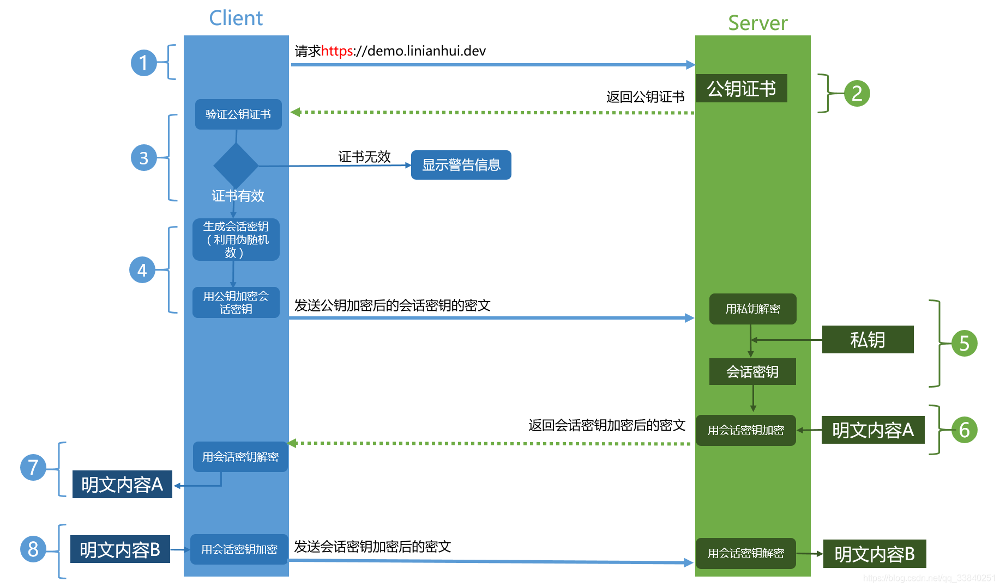

## 1.http 和 tcp 协议

- TCP 链接

1. 手机能够使用联网功能是因为手机底层实现了 TCP/IP 协议，可以使手机终端通过无线网络建立 TCP 连接。TCP 协议可以对上层网络提供接口，使上层网络数据的传输建立在“无差别”的网络之上。 
2. 建立 TCP 链接需要三次握手
   1. 客户端发送 syn 包(syn=j)到服务器，并进入 SYN_SEND 状态，等待服务器确认；
   2. 服务器收到 syn 包，必须确认客户的 SYN（ack=j+1），同时自己也发送一个 SYN 包（syn=k），即 SYN+ACK 包，此时服务器进入 SYN_RECV 状态；
   3. 客户端收到服务器的 SYN ＋ ACK 包，向服务器发送确认包 ACK(ack=k+1)，此包发送完毕，客户端和服务器进入 ESTABLISHED 状态，完成三次握手。
3. 完成三次握手，客户端与服务器才正式开始传送数据

- HTTP 链接

1.  HTTP 协议即超文本传送协议(Hypertext Transfer Protocol )，是 Web 联网的基础，也是手机联网常用的协议之一，HTTP 协议是建立在 TCP 协议之上的一种应用。
2.  特点：客户端发送的每次请求都需要服务器回送响应，在请求结束后，会主动释放连接
    1. 在 HTTP 1.0 中，客户端的每次请求都要求建立一次单独的连接，在处理完本次请求后，就自动释放连接。
    2. 在 HTTP 1.1 中则可以在一次连接中处理多个请求，并且多个请求可以重叠进行，不需要等待一个请求结束后再发送下一个请求。
3.  由于 HTTP 在每次请求结束后都会主动释放连接，因此 HTTP 连接是一种“短连接”

- 相互关系

1. http 是要基于 TCP 连接基础上的
   1. TCP 就是单纯建立连接，不涉及任何我们需要请求的实际数据，简单的传输。
   2. http 是用来收发数据，即实际应用上来的。
   3. 过程：从传输层，先说下 TCP 连接，我们要和服务端连接 TCP 连接，需要通过三次连接，包括：请求，确认，建立连接。即传说中的“三次握手协议”。
      简单就是:请求，确认，连接
2. 从实际上的数据应用来说 http
   在前面客户端和应用服务器建立 TCP 连接之后，就需要用 http 协议来传送数据了，HTTP 协议简单来说，还是请求，确认，连接。
3. TCP 是底层通讯协议，定义的是数据传输和连接方式的规范 1. HTTP 是应用层协议，定义的是传输数据的内容的规范 2. HTTP 协议中的数据是利用 TCP 协议传输的，所以支持 HTTP 也就一定支持 TCP
   3. HTTP 支持的是 www 服务,而 TCP/IP 是协议 4. 它是 Internet 国际互联网络的基础。TCP/IP 是网络中使用的基本的通信协议。 5. TCP/IP 实际上是一组协议，它包括上百个各种功能的协议，如：远程登录、文件传输和电子邮件等，而 TCP 协议和 IP 协议是保证数据完整传输的两个基本的重要协议。通常说 TCP/IP 是 Internet 协议族，而不单单是 TCP 和 IP。
      <a href='https://www.cnblogs.com/wx-1996/p/10685576.html' target='_blank'>HTTP 与 TCP 的区别和联系</a>

## 2.HTTP 状态码

200 正常  
302 表示临时性重定向。访问一个 Url 时，被重定向到另一个 url 上。 
401 请求需要认证 
403 请求对应资源禁止访问 
404 服务器无法找到对应资源 
502 网关错误 
504 网关超时 

## 3.https 和 http 是的区别

- HTTP
  超文本传输协议，明文传输，不安全
- HTTPS

1. https 在 http 的基础上加入了 SSL 协议，SSL 依靠证书来验证服务器的身份，并在浏览器和服务器之间加密 
2. https 是由 SSL+http 协议构建的可进行加密传输，身份认证的网络协议 
3. 因为 http 是明文传输未加密，不安全，所以设计了 SSL 协议用于对 http 协议传输进行加密 

- HTTPS 工作流程
  
   
   

1. Client 发起一个 HTTPS（https:/demo.linianhui.dev）的请求，根据 RFC2818 的规定，Client 知道需要连接 Server 的 443（默认）端口。
2. Server 把事先配置好的公钥证书（public key certificate）返回给客户端。
3. Client 验证公钥证书：比如是否在有效期内，证书的用途是不是匹配 Client 请求的站点，是不是在 CRL 吊销列表里面，它的上一级证书是否有效，这是一个递归的过程，直到验证到根证书（操作系统内置的 Root 证书或者 Client 内置的 Root 证书）。如果验证通过则继续，不通过则显示警告信息。
4. Client 使用伪随机数生成器生成加密所使用的会话密钥，然后用证书的公钥加密这个会话密钥，发给 Server。
5. Server 使用自己的私钥（private key）解密这个消息，得到会话密钥。至此，Client 和 Server 双方都持有了相同的会话密钥。
6. Server 使用会话密钥加密“明文内容 A”，发送给 Client。
7. Client 使用会话密钥解密响应的密文，得到“明文内容 A”。
8. Client 再次发起 HTTPS 的请求，使用会话密钥加密请求的“明文内容 B”，然后 Server 使用会话密钥解密密文，得到“明文内容 B”。

- HTTPS 优点

1. 使用 https 可以认证用户和服务器，确保数据发送到正确的客户机和服务器
2. https 使用 SSL+http 构建的可加密传输、身份认证的网络协议，比 http 更加安全
3. https 是现行最安全的解决方案，增加了中间人的盗取成本

- HTTPS 缺点

1. https 协议握手比较费时，会使页面加载时间延长
2. https 的缓存不如 http 高效，增加数据开销
3. SSL 协议需要成本费用
4. SSL 需要绑定 IP，不能在同一个 IP 绑定多个域名
5. https 加密范围有限

- HTTP 和 HTTPS 区别

1. https 协议需要 ca 申请证书
2. http 是超文本传输协议，是明文传输，https 是具有安全性 SSL 加密传输协议，可进行加密传输，身份认证的网络协议，比 http 更安全
3. http 和 https 使用的不同的连接方式，用的端口也不一样，http 默认端口是 80,https 默认端口是 443

<a href='https://www.jianshu.com/p/97af35e81912' target='_blank'>HTTP 与 HTPPS 的区别</a>

## 4.HTTP1.0 和 HTTP1.1 的区别

- 1.0 存在的问题
  - 无法复用连接，每次都需要建立 TCP 连接，而 TCP 连接释放过程又比较费时
  - 队头阻塞，由于 HTTP1.0 规定下一个请求必须在前一个请求响应到达之前才能发送，假设前一个请求响应一直不到达，那么下一个请求就不发送，后面的请求就阻塞了。
- 缓存处理（cache-control）
  - 强缓存
  - 协商缓存
- 带宽优化及网络连接的使用
- 增加 host 字段，支持断点传输等
- 长连接
  - 增加了 Connection 字段，通过设置 keep-alive 保持连接不断，避免每次客户端和服务端请求建立释放 TCP 链接，提高网络利用率

## 5.Http1.x 和 http2.0 的差别

- **新的二进制格式**（Binary Format），HTTP1.x 的解析是基于文本。基于文本协议的格式解析存在天然缺陷，文本的表现形式有多样性，要做到健壮性考虑的场景必然很多，二进制则不同，只认 0 和 1 的组合。基于这种考虑 HTTP2.0 的协议解析决定采用二进制格式，实现方便且健壮。
- **多路复用**（MultiPlexing），即连接共享，即每一个 request 都是是用作连接共享机制的。一个 request 对应一个 id，这样一个连接上可以有多个 request，每个连接的 request 可以随机的混杂在一起，接收方可以根据 request 的 id 将 request 再归属到各自不同的服务端请求里面。
- **header 压缩**，如上文中所言，对前面提到过 HTTP1.x 的 header 带有大量信息，而且每次都要重复发送，HTTP2.0 使用 encoder 来减少需要传输的 header 大小，通讯双方各自 cache 一份 header fields 表，既避免了重复 header 的传输，又减小了需要传输的大小。
- **服务端推送**（server push），同 SPDY 一样，HTTP2.0 也具有 server push 功能。

## 6.ws 和 ajax 的区别。

- 本质不同，ajax 是调用浏览器的 xmlhttprequest，是一种创建交互式网页应用的网页开发技术
- ws 是 THML5 的一种新的协议，实现了浏览器与服务器全双工通信，其本质是通过 HTTP/HTTPS 协议进行握手后创立于一个用于交换数据的 TCP 链接，服务端与客户端通过 TCP 链接进行通信
- 声明周期，ajax 是短连接，数据发送完和接收完会断开链接，ws 是长链接，会在一个会话中一直保存连接
- websocket 一般用于前后端实时数据交互，而 ajax 前后端非实时数据交互
- Ajax 技术需要客户端发起请求，而 WebSocket 服务器和客户端可以相互推送信息。

## 7.ws 的长链接 和 http 的长链接 是一个东西吗

- HTTP1.1 通过使用 Connection:keep-alive 进行长连接，HTTP 1.1 默认进行持久连接。在一次 TCP 连接中可以完成多个 HTTP 请求，但是对每个请求仍然要单独发 header，Keep-Alive 不会永久保持连接，它有一个保持时间，可以在不同的服务器软件（如 Apache）中设定这个时间。这种长连接是一种“伪链接”
- websocket 的长连接，是一个真的全双工。长连接第一次 tcp 链路建立之后，后续数据可以双方都进行发送，不需要发送请求头。
- keep-alive 双方并没有建立正真的连接会话，服务端可以在任何一次请求完成后关闭。WebSocket 它本身就规定了是正真的、双工的长连接，两边都必须要维持住连接的状态

## 8.keep-alive 是什么

- 开启 HTTP Keep-Alive 之后，能复用已有的 TCP 链接，当前一个请求已经响应完毕，服务器端没有立即关闭- TCP 链接，而是等待一段时间接收浏览器端可能发送过来的第二个请求，通常浏览器在第一个请求返回之后会立即发送第二个请求，如果某一时刻只能有一个链接，同一个 TCP 链接处理的请求越多，开启 KeepAlive 能节省的 TCP 建立和关闭的消耗就越多。
- 当然通常会启用多个链接去从服务器器上请求资源，但是开启了 Keep-Alive 之后，仍然能加快资源的加载速度。HTTP/1.1 之后默认开启 Keep-Alive, 在 HTTP 的头域中增加 Connection 选项。当设置为`Connection:keep-alive`表示开启，设置为`Connection:close`表示关闭。

## 9.一个页面从输入 URL 到页面加载显示完成，这个过程中都发生了什么？

- 首先在浏览器中输入 URL

- 查找缓存：浏览器先查看浏览器缓存-系统缓存-路由缓存中是否有该地址页面，如果有则显示页面内容。如果没有则进行下一步。

  - 浏览器缓存：浏览器会记录 DNS 一段时间，因此，只是第一个地方解析 DNS 请求；
  - 操作系统缓存:如果在浏览器缓存中不包含这个记录，则会使系统调用操作系统， 获取操作系统的记录(保存最近的 DNS 查询缓存)；
  - 路由器缓存：如果上述两个步骤均不能成功获取 DNS 记录，继续搜索路由器缓存；
  - ISP 缓存：若上述均失败，继续向 ISP 搜索。

- DNS 域名解析：浏览器向 DNS 服务器发起请求，解析该 URL 中的域名对应的 IP 地址。DNS 服务器是基于 UDP 的，因此会用到 UDP 协议。

- 建立 TCP 连接：解析出 IP 地址后，根据 IP 地址和默认 80 端口，和服务器建立 TCP 连接

- 发起 HTTP 请求：浏览器发起读取文件的 HTTP 请求，，该请求报文作为 TCP 三次握手的第三次数据发送给服务器

- 服务器响应请求并返回结果：服务器对浏览器请求做出响应，并把对应的 html 文件发送给浏览器

- 关闭 TCP 连接：通过四次挥手释放 TCP 连接

- 浏览器渲染：客户端（浏览器）解析 HTML 内容并渲染出来，浏览器接收到数据包后的解析流程为：

  - 构建 DOM 树：词法分析然后解析成 DOM 树（dom tree），是由 dom 元素及属性节点组成，树的根是 document 对象
  - 构建 CSS 规则树：生成 CSS 规则树（CSS Rule Tree）
  - 构建 render 树：Web 浏览器将 DOM 和 CSSOM 结合，并构建出渲染树（render tree）
  - 布局（Layout）：计算出每个节点在屏幕中的位置
  - 绘制（Painting）：即遍历 render 树，并使用 UI 后端层绘制每个节点。
     
     
     
    
