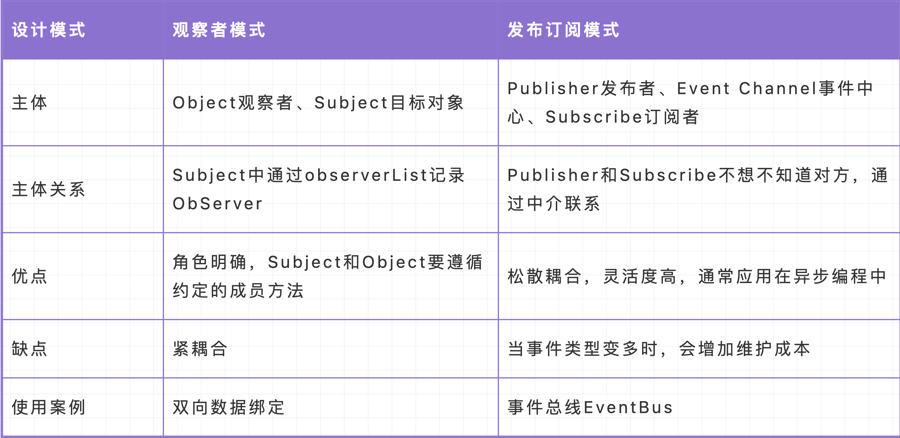

## 1. 发布订阅
```js
class Event{
    constructor(){
      this.event = {}
    }
    on(typeName,cb){
      if(this.event[typeName]){
        this.event[typeName].push(cb)
      }else {
        this.event[typeName] = [cb]
      }
    }
    emit(typeName,...args){
      if(this.event[typeName]){
        this.event[typeName].forEach((c)=>c(...args))
      }
    }
    off(typeName,fn){
      if(this.event[typeName] > 0){
        let index = this.event[typeName].findIndex(c=>c === fn);
        if(index !== -1) this.event[typeName].splice(index,1)
        
      }
    }
  }
```
## 2. 观察者模式
```js
 // 被观察者
  class Subject{
    constructor(name){
      this.name = name;
      this.result = [];
    }
    attach(o){
      this.result.push(o)
    }
    setState(newState){
      this.name = newState;
      this.result.forEach(i=>i.update())
    }
  }

  // 观察者
  class Observe{
    constructor(){}
    update(){
      console.log('被观察者更新了')
    }
  }
```
- 两者的区别
  - 对象关系
  观察者模式中，被观察者和观察者之间的关系是一对多的关系，即一个被观察者可以有多个观察者，但是每个观察者只关注一个被观察者。被观察者维护一个观察者列表，当被观察者发生变化时，通知所有观察者进行相应的处理。
  发布订阅模式中，发布者和订阅者之间的关系是多对多的关系，即一个发布者可以有多个订阅者，每个订阅者可以关注多个发布者。发布者和订阅者之间通过「发布-订阅中心」进行通信，当发布者发生变化时，通知所有订阅者进行相应的处理。

  - 解耦
  在观察者模式中，被观察者和观察者之间的通信是直接的，即被观察者会直接调用观察者的方法进行通信。这种直接的通信方式可能会导致被观察者与观察者之间的耦合度较高。
  在发布订阅模式中，发布者和订阅者之间的通信是通过「发布-订阅中心」进行的，即发布者不直接与订阅者通信，而是通过「发布-订阅中心」进行通信。这种间接的通信方式可以降低发布者与订阅者之间的耦合度。
  <br />
  <br />
  
  <a href='https://www.jb51.net/article/283829.htm' target='_blank'>发布订阅和观察者模式</a>