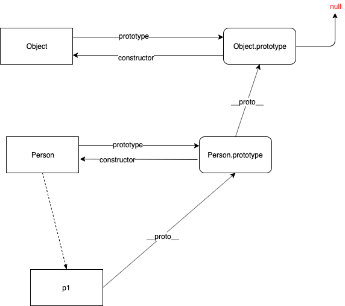
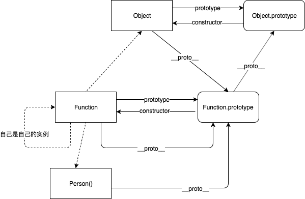

## 1.对象的原型链
```js
function Person(){}
let p1 = new Person()
p1.__proto__ === Person.prototype //true
Person.prototype.__proto__ === Object.prototype //true
Object.prototype.__proto__ === null //true
```
<br />


## 2.内置对象
- 数组
```js
let arr = [];
arr.__proto__ === Array.prototype //true
Array.prototype.__proto__ === Object.prototype //true
Object.prototype.__proto__ === null //true
```
- Date
```js
let date = new Date()
date.__proto__ === Date.prototype //true
Date.prototype.__proto__ === Object.prototype //true
Object.prototype.__proto__ === null //true
```
- new Object()
```js
let o = new Object()
o.__proto__ === Object.prototype
```
- {}
```js
let obj = {};
obj.__proto__ === Object.prototype //true
```
## 3.函数
- 普通函数
```js
function fn(){}
fn.__proto__ === Function.prototype
Function.prototype.__proto__ === Object.prototype //true
```
- new Function
```js
let fn = new Function()
fn.__proto__ === Function.prototype
Function.prototype.__proto__ === Object.prototype //true
```
- 内置函数
```js
parseInt.__proto__ === Function.prototype //true
toString.__proto__ === Function.prototype //true
```
<br />


## 4.完整原型链
<br />
<br />
