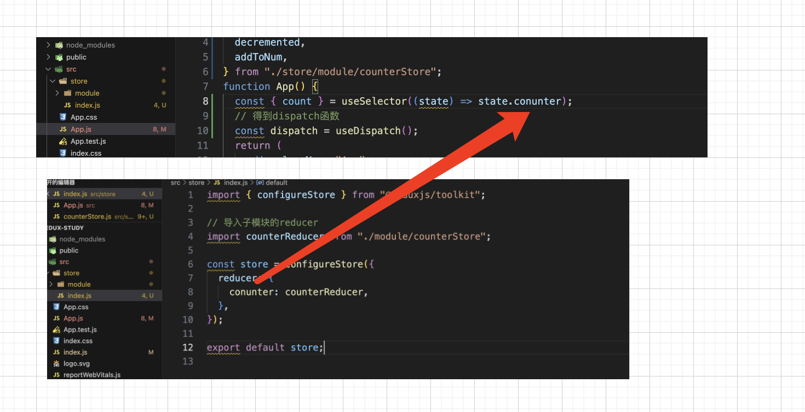

# redux

## 下载

```js
  npm install @reduxjs/toolkit
  npm install react-redux
```

## 创建目录

```
- src
	- store
		- module
			- counterStore.js
		- index.js
```

## 编写代码

1. counterStore.js

```javascript
import { createSlice } from "@reduxjs/toolkit";

const counterStore = createSlice({
  name: "counter",
  // 初始化state
  initialState: {
    count: 0,
  },
  // 定义修改状态的方法，同步执行，支持直接修改
  reducers: {
    incremented(state) {
      state.count += 1;
    },
    decremented(state) {
      state.count -= 1;
    },
  	// 传参
    addToNum(state, action) {
      // action.payload拿到传递的参数
      state.count = action.payload;
    },
  },
});

const { incremented, decremented，addToNum } = counterStore.actions;

// 获取reducer
const reducer = counterStore.reducer;

// 导出
export { incremented, decremented，addToNum };

export default reducer;

```

2. store=>index.js

```javascript
import { configureStore } from "@reduxjs/toolkit";

// 导入子模块的reducer
import counterReducer from "./module/counterStore";

const store = configureStore({
  reducer: {
    conunter: counterReducer,
  },
});

export default store;
```

3. src=>index.js

```javascript
import store from "./store";
import { Provider } from "react-redux";
const root = ReactDOM.createRoot(document.getElementById("root"));

root.render(
  <React.StrictMode>
    <Provider store={store}>
      <App />
    </Provider>
  </React.StrictMode>
);
```

## 在组件中使用

1. 获取 state 上的数据

```javascript
import { useSelector, useDispatch } from "react-redux";
import { incremented, decremented } from "./store/module/counterStore";
function App() {
  const { count } = useSelector((state) => state.conunter);
  // 得到dispatch函数
  const dispatch = useDispatch();
  return (
    <div className="App">
      <button
        onClick={() => {
          dispatch(decremented());
        }}
      >
        -
      </button>
      <span>{count}</span>
      <button
        onClick={() => {
          dispatch(incremented());
        }}
      >
        +
      </button>
      <button
        onClick={() => {
          dispatch(addToNum(10));
        }}
      >
        redux传参直接赋值10
      </button>
    </div>
  );
}

export default App;
```



## 异步请求

1. store=>module=>channerStore.js

```javascript
import { createSlice } from "@reduxjs/toolkit";
import axios from "axios";
const channerStore = createSlice({
  name: "channner",
  initialState: {
    channerList: [],
  },
  reducers: {
    setChannerList(state, action) {
      state.channerList = action.payload;
    },
  },
});

const { setChannerList } = channerStore.actions;

// 声明一个函数去发起异步请求

const getChannerList = () => {
  return async (dispatch) => {
    let res = await axios.get("http://geek.itheima.net/V1_0/channels");
    dispatch(setChannerList(res.data.data.channels));
  };
};

export { getChannerList };

const reducer = channerStore.reducer;

export default reducer;
```

2. store=>index.js

```js
import { configureStore } from "@reduxjs/toolkit";

// 导入子模块的reducer
import counterReducer from "./module/counterStore";
// 导入字模块的reducer
import channerReducer from "./module/channerStore";

const store = configureStore({
  reducer: {
    conunter: counterReducer,
    channer: channerReducer,
  },
});

export default store;
```

3. 组件中使用

```javascript
import { useEffect } from "react";
import { useSelector, useDispatch } from "react-redux";
import {
  incremented,
  decremented,
  addToNum,
} from "./store/module/counterStore";

// 导入异步的store
import { getChannerList } from "./store/module/channerStore";

function App() {
  const { count } = useSelector((state) => state.conunter);
  const { channerList } = useSelector((state) => state.channer);
  // 得到dispatch函数
  const dispatch = useDispatch();

  // 使用useEffect发起异步请求
  useEffect(() => {
    dispatch(getChannerList());
  }, [dispatch]);
  return (
    <div className="App">
      <button
        onClick={() => {
          dispatch(decremented());
        }}
      >
        -
      </button>
      <span>{count}</span>
      <button
        onClick={() => {
          dispatch(incremented());
        }}
      >
        +
      </button>
      <button
        onClick={() => {
          dispatch(addToNum(10));
        }}
      >
        redux传参直接赋值10
      </button>
      <ul>
        {channerList.map((item) => (
          <li key={item.id}>{item.name}</li>
        ))}
      </ul>
    </div>
  );
}

export default App;
```
