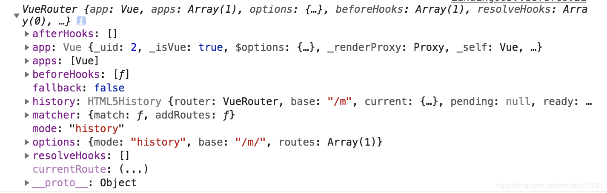

## 1.MVVM 的理解

- MVC

model+view+controller 用户操作会请求服务端路由，路由会调用对应的控制器来处理,控制器会获取数据。将结果返回给前端,页面重新渲染

- MVVM

mode+view+viewmode 传统的前端会将数据手动渲染到页面上,`MVVM`模式不需要用户收到操作`dom`元素,将数据绑定到`viewModel`层上，会自动将数据渲染到页面中，视图变化会通知`viewModel层`更新数据。`ViewModel`就是我们`MVVM`模式中的桥梁.

## 2.Vue 理解

- vue

渐进性框架，是一种自底而上的增量开发设计
渐进性<br />
在声明式渲染(模板视图渲染)的基础上,可以通过增加组件系统(components),理由(vue-router),状态管理(vuex)来构建一个完整的框架<br />
声明式渲染和组件库是 Vue 的核心内容,而数据状态管理,路由,构架工具都有专门的独立方案解决<br />
'渐进式'是 vue 的提现方式，也是他的设计理念

## 3.响应式数据原理

1. 调用 new observer 的 defaultReact 通过递归给对象的每一个属性添加 Object.defineProperty,并创建 dep 实例保存相关依赖
2. Dep 实例保存一个 sub 数组，保存的依赖添加到数组中，更新依赖调用数组中的 update 方法
3. 依赖是一时 watch 实例，保存了数据变化时需要更新的操作，并且将自己放入全局中，读取数据时，触发数据的 get，将自身收集到 dep 数组中

<br />
<br />


```js
Object.defineProperty(obj, key, {
  enumerable: true,
  configurable: true,
  get: function reactiveGetter() {
    const value = getter ? getter.call(obj) : val
    if (Dep.target) {
      dep.depend() // ** 收集依赖 ** /
      if (childOb) {
        childOb.dep.depend()
        if (Array.isArray(value)) {
          dependArray(value)
        }
      }
    }
    return value
  },
  set: function reactiveSetter(newVal) {
    const value = getter ? getter.call(obj) : val
    if (newVal === value || (newVal !== newVal && value !== value)) {
      return
    }
    if (process.env.NODE_ENV !== "production" && customSetter) {
      customSetter()
    }
    val = newVal
    childOb = !shallow && observe(newVal)
    dep.notify() /**通知相关依赖进行更新**/
  },
})
```

## 4.Vue 中是如何检测数组变化?

1. 使用函数劫持的方式，重写了数组的方法
2. `Vue`将`data`中的数组，进行了原型链重写。指向了自己定义的数组原型方法，这样当调用数组`api`时，可以通知依赖更新.如果数组中包含着引用类型。会对数组中的引用类型再次进行监控。
   <br />
   <br />
   

```js
const arrayProto = Array.prototype
export const arrayMethods = Object.create(arrayProto)
const methodsToPatch = [
  "push",
  "pop",
  "shift",
  "unshift",
  "splice",
  "sort",
  "reverse",
]
methodsToPatch.forEach(function(method) {
  // 重写原型方法
  const original = arrayProto[method] // 调用原数组的方法
  def(arrayMethods, method, function mutator(...args) {
    const result = original.apply(this, args)
    const ob = this.__ob__
    let inserted
    switch (method) {
      case "push":
      case "unshift":
        inserted = args
        break
      case "splice":
        inserted = args.slice(2)
        break
    }
    if (inserted) ob.observeArray(inserted)
    // notify change
    ob.dep.notify() // 当调用数组方法后，手动通知视图更新
    return result
  })
})

this.observeArray(value) // 进行深度监控
```

## 5.computed 的特点

- 1.会有缓存，当依赖发生变化时，采取更新视图
  <br />
  
  <br />

```js
function initComputed(vm: Component, computed: Object) {
  const watchers = (vm._computedWatchers = Object.create(null))
  const isSSR = isServerRendering()
  for (const key in computed) {
    const userDef = computed[key]
    const getter = typeof userDef === "function" ? userDef : userDef.get
    if (!isSSR) {
      // create internal watcher for the computed property.
      watchers[key] = new Watcher(
        vm,
        getter || noop,
        noop,
        computedWatcherOptions
      )
    }

    // component-defined computed properties are already defined on the
    // component prototype. We only need to define computed properties defined
    // at instantiation here.
    if (!(key in vm)) {
      defineComputed(vm, key, userDef)
    } else if (process.env.NODE_ENV !== "production") {
      if (key in vm.$data) {
        warn(`The computed property "${key}" is already defined in data.`, vm)
      } else if (vm.$options.props && key in vm.$options.props) {
        warn(`The computed property "${key}" is already defined as a prop.`, vm)
      }
    }
  }
}
function createComputedGetter(key) {
  return function computedGetter() {
    const watcher = this._computedWatchers && this._computedWatchers[key]
    if (watcher) {
      if (watcher.dirty) {
        // 如果依赖的值没发生变化,就不会重新求值
        watcher.evaluate()
      }
      if (Dep.target) {
        watcher.depend()
      }
      return watcher.value
    }
  }
}
```

## 6.computed 和 methods 和 watcher 区别

### computed

- 1. 简便逻辑操作，
- 2. 执行时，只执行直接调用的变量
- 3. 有缓存，如果数据不进行更新，则不会从新触发计算，从而节约性能
- 4. 不便于操作异步
- 5. compouted 默认不会先执行
- 6. computed 是计算一个新的属性，并将该属性挂载到 vm（Vue 实例）上
- 7. computed 本质是一个**惰性求值的观察者**，具有缓存性，只有当依赖变化后，第一次访问 computed 属性，才会计算新的值
- 8. computed 适用一个数据被多个数据影响

### methods：

- 1. 无缓存，每次都会重新计算
- 2. 视图更新时都会从新计算

### watcher(一方改变，另一方跟着改变)

- 1. 代码复用性高
- 2. 便于处理异步
- 3. 高消耗性能的操作,限制我们执行该操作的频率，并在我们得到最终结果前，设置中间件
- 4. 混合使用
- 5. watch 会先执行
- 6. watch 是监听已经存在且已挂载到 vm 上的数据，所以用 watch 同样可以监听 computed 计算属性的变化（其它还有 data、props）
- 7. watch 则是当数据发生变化便会调用执行函数
- 8. watch 适用一个数据影响多个数据

## 7.生命周期

### 每个生命周期的用途

- `beforeCreate`
  - （创建前）：数据观测和初始化事件还未开始，此时 data 的响应式追踪、event/watcher 都还没有被设置，也就是说不能访问到data、computed、watch、methods 上的方法和数据。
- `created`
  - （创建后） ：实例创建完成，实例上配置的 options 包括 data、computed、watch、methods 等都配置完成，但是此时渲染得节点还未挂载到 DOM，所以不能访问到 $el 属性。
- `beforeMount`
  - （挂载前）：在挂载开始之前被调用，相关的render函数首次被调用。实例已完成以下的配置：编译模板，把data 里面的数据和模板生成html。此时还没有挂载html 到页面上。
- `mounted`
  - （挂载后）：在 el 被新创建的 vm.\$el 替换，并挂载到实例上去之后调用。实例已完成以下的配置：用上面编译好的 html 内容替换el 属性指向的DOM 对象。完成模板中的 html 渲染到html 页面中。此过程中进行ajax 交互。
- `beforeUpdate`
  - （更新前）：响应式数据更新时调用，此时虽然响应式数据更新了，但是对应的真实 DOM 还没有被渲染。
- `updated`
  - （更新后） ：在由于数据更改导致的虚拟 DOM 重新渲染和打补丁之后调用。此时 DOM 已经根据响应式数据的变化更新了。调用时，组件 DOM 已经更新，所以可以执行依赖于 DOM 的操作。然而在大多数情况下，应该避免在此期间更改状态，因为这可能会导致更新无限循环。该钩子在服务器端渲染期间不被调用。
- `beforeDestroy`
  - （销毁前）：实例销毁之前调用。这一步，实例仍然完全可用，this 仍能获取到实例。
- `destroyed`
  - 销毁后）：实例销毁后调用，调用后，Vue 实例指示的所有东西都会解绑定，所有的事件监听器会被移除，所有的子实例也会被销毁。该钩子在服务端渲染期间不被调用。

### 每个声明周期需要做的的事情

- `created`
  - 实例已经创建完成，因为它是最早触发的原因可以进行一些数据，资源的请求。
- `mounted`
  - 实例已经挂载完成，可以进行一些DOM操作
- `beforeUpdate`
  - 可以在这个钩子中进一步地更改状态，这不会触发附加的重渲染过程。
- `updated`
  - 可以执行依赖于 DOM 的操作。然而在大多数情况下，你应该避免在此期间更改状态，因为这可能会导致更新无限循环。 该钩子在服务器端渲染期间不被调用。
-`destroyed` 
  - 可以执行一些优化操作,清空定时器，解除绑定事件
  <br />
  <br />
  
  <br />
  <br />
  <br />
  <br />
  

## 8.v-show 和 v-if 的区别

- `v-show` 只是切换当前`dom`的显示或者隐藏
- `v-if` 如果条件不成立不会渲染当前指令所在节点的`dom`元素

```js
const VueTemplateCompiler = require("vue-template-compiler")
let r1 = VueTemplateCompiler.compile(
  `<div v-if="true"><span v-for="i in 3">hello</span></div>`
)
/**
with(this) {
    return (true) ? _c('div', _l((3), function (i) {
        return _c('span', [_v("hello")])
    }), 0) : _e()
}
*/
```

```js
const VueTemplateCompiler = require('vue-template-compiler');
let r2 = VueTemplateCompiler.compile(`<div v-show="true"></div>`);
/**
with(this) {
    return _c('div', {
        directives: [{
            name: "show",
            rawName: "v-show",
            value: (true),
            expression: "true"
        }]
    })
}
 */

// v-show 操作的是样式  定义在platforms/web/runtime/directives/show.js
bind (el: any, { value }: VNodeDirective, vnode: VNodeWithData) {
    vnode = locateNode(vnode)
    const transition = vnode.data && vnode.data.transition
    const originalDisplay = el.__vOriginalDisplay =
      el.style.display === 'none' ? '' : el.style.display
    if (value && transition) {
      vnode.data.show = true
      enter(vnode, () => {
        el.style.display = originalDisplay
      })
    } else {
      el.style.display = value ? originalDisplay : 'none'
    }
}
```

## 9.v-for 和 v-if

`v-for`比`v-if`的优先级要高，如果连用，给每个属性都添加，造成资源浪费

```js
const VueTemplateCompiler = require("vue-template-compiler")
let r1 = VueTemplateCompiler.compile(
  `<div v-if="false" v-for="i in 3">hello</div>`
)
/**
with(this) {
    return _l((3), function (i) {
        return (false) ? _c('div', [_v("hello")]) : _e()
    })
}
*/
console.log(r1.render)
```

## 10.组件中的 `data`为什么是一个函数?

- 1. 同一个组件被复用多次，会创建多个实例。
- 2. 这些实例用的是同一个构造函数，如果`data`是一个对象的话。那么所有组件都共享了同一个对象
- 3. 为了保证组件的数据独立性要求每个组件必须通过`data`函数返回一个对象作为组件的状态。

## 11.`Vue`组件如何通信?

- 1. 父子间通信 父->子通过`props`、子-> 父`$on、$emit`
- 2. 获取父子组件实例的方式`$parent、$children`
- 3. 在父组件中提供数据子组件进行消费 `Provide、inject`
- 4. `Ref`获取实例的方式调用组件的属性或者方法
- 5. `Event Bus` 实现跨组件通信
- 6. `Vuex`状态管理实现通信

## 12. vue中模板编译原理？
  - 解析阶段：使用大量的正则表达式对template 字符串进行解析，将标签、指令、属性等转化为抽象语法树AST。
  - 优化阶段：遍历AST，找到其中的一些静态节点并进行标记，方便在页面重渲染的时候进行diff 比较时，直接跳过这一些静态节点，优化runtime 的性能。
  - 生成阶段：将最终的AST 转化为render 函数字符串。

## 13. Vue.mixin的使用场景和原理
  - Vue.mixin的作用就是抽离公共的业务逻辑，原理类似”对象的继承“，当组件初始化时会调用mergeOptions方法进行合并，并采用策略模式针对不同的属性进行合并。
  - Mixin的生命周期会在父组件生命周期之前执行，如果混入的数据和本身组件中的数据冲突，会采用”就近原则“以组件的数据为准。
  - mixin中有很多缺陷：”命名冲突“、依赖问题、数据来源问题，这里强调一下mixin的数据是不会被共享的。

## 14. nextTick实现原理
```js
let timerFunc // nextTick异步实现fn

if (typeof Promise !== "undefined" && isNative(Promise)) {
  // Promise方案
  const p = Promise.resolve()
  timerFunc = () => {
    p.then(flushCallbacks) // 将flushCallbacks包装进Promise.then中
  }
  isUsingMicroTask = true
} else if (
  !isIE &&
  typeof MutationObserver !== "undefined" &&
  (isNative(MutationObserver) ||
    MutationObserver.toString() === "[object MutationObserverConstructor]")
) {
  // MutationObserver方案
  let counter = 1
  const observer = new MutationObserver(flushCallbacks) // 将flushCallbacks作为观测变化的cb
  const textNode = document.createTextNode(String(counter)) // 创建文本节点
  // 观测文本节点变化
  observer.observe(textNode, {
    characterData: true,
  })
  // timerFunc改变文本节点的data，以触发观测的回调flushCallbacks
  timerFunc = () => {
    counter = (counter + 1) % 2
    textNode.data = String(counter)
  }
  isUsingMicroTask = true
} else if (typeof setImmediate !== "undefined" && isNative(setImmediate)) {
  // setImmediate方案
  timerFunc = () => {
    setImmediate(flushCallbacks)
  }
} else {
  // 最终降级方案setTimeout
  timerFunc = () => {
    setTimeout(flushCallbacks, 0)
  }
}
```
- Vue的数据频繁变化，但为什么dom只会更新一次？
  1. nextTick是Vue提供的一个全局API,是在下次DOM更新循环结束之后执行延迟回调，在修改数据之后使用$nextTick，则可以在回调中获取更新后的DOM；
  2. Vue在更新DOM时是异步执行的。只要侦听到数据变化，Vue将开启1个队列，并缓冲在同一事件循环中发生的所有数据变更。如果同一个watcher被多次触发，只会被推入到队列中-次。这种在缓冲时去除重复数据对于避免不必要的计算和DOM操作是非常重要的。
  3. nextTick方法会在队列中加入一个回调函数，确保该函数在前面的dom操作完成后才调用；
- 实现原理
  - 在下次 DOM 更新循环结束之后执行延迟回调，在修改数据之后立即使用 nextTick 来获取更新后的 DOM。 nextTick主要使用了宏任务和微任务。 根据执行环境分别尝试采用Promise、MutationObserver、setImmediate，如果以上都不行则采用setTimeout定义了一个异步方法，多次调用nextTick会将方法存入队列中，通过这个异步方法清空当前队列。

## 15.Vue.use()执行原理

- Vue.use 源码分析

```js
import { toArray } from "../util/index"

export function initUse(Vue: GlobalAPI) {
  Vue.use = function(plugin: Function | Object) {
    // 限制了自定义组建的类型
    const installedPlugins =
      this._installedPlugins || (this._installedPlugins = [])
    //保存注册组件的数组，不存在及创建
    if (installedPlugins.indexOf(plugin) > -1) {
      //判断该组件是否注册过，存在return Vue对象
      return this
    }
    //调用`toArray`方法
    const args = toArray(arguments, 1)
    args.unshift(this)
    //将Vue对象拼接到数组头部
    if (typeof plugin.install === "function") {
      //如果组件是对象，且提供install方法，调用install方法将参数数组传入，改变`this`指针为该组件
      plugin.install.apply(plugin, args)
    } else if (typeof plugin === "function") {
      //如果传入组件是函数，这直接调用，但是此时的`this`指针只想为`null`
      plugin.apply(null, args)
    }
    //在保存注册组件的数组中添加
    installedPlugins.push(plugin)
    return this
  }
}
```

- toArray 方法源码

```js
export function toArray(list: any, start?: number): Array<any> {
  start = start || 0
  let i = list.length - start
  //将存放参数的数组转为数组，并除去第一个参数（该组件）
  const ret: Array<any> = new Array(i)
  //循环拿出数组
  while (i--) {
    ret[i] = list[i + start]
  }
  return ret
}
```

### Vue.use()是通过`initUse`进行初始化

- 1.`vue.use（plugin, arguments）`接受一个参数`plugin`,这个`plugin`只接收两种类新型，`plugin(Function | Object)`,如果是对象，需要提供一个`install方法`,如果是是函数，会被当成`install`方法进行执行。
- 2.方法检测了`installedPlugins`数组中是否已包含想要注册的组件，可知插件只被注册一次，二次注册是无效的
- 3.调用`toArray`方法，将传入的参数转成数组
- 4.把当前 Vue 对象 this 插入到转成数组的前面
- 5.判断`plugin.install`是否是一个方法，如果是，则传入`plugin`及转化后的数组,如果`plugin`本身就是一个方法，则传入转化后的数组，然后执行这个方法,由此可知，Vue.use(插件),实际上就是调用插件的`install`方法，并且调用 use 的时候是可以传入参数的
- 6.将注册后的插件推进`installedPlugins`，避免重复注册，返回当前实例，代码执行结束。

## 16.Vue 中 key 值的作用

- 1.用于管理可复用的元素。因为 Vue 会尽可能高效地渲染元素，通常会复用已有元素而不是从头开始渲染。这么做使 Vue 编译变得非常快

- 2.Vue 会尽可能的复用当前页面上所有的元素，如果元素没有独立的 key 值的话，如果我们只修改了元素的属性，那 Vue 会重复使用页面上的元素，只是给它修改一个属性

- 3.在 diff 算法中，Vue 使用 key 值来判断元素是否发生更改，以达到重复使用页面上所有可复用元素，特别是在列表渲染中，Vue 通过 key 值来判断元素是否需要更新，如果元素只是更换位置的话，就不需要重新渲染，这也是为什么我们在列表渲染的时候为什么始终不建议使用元素的索引值来作为 key 值，因为索引值始终会发生改变，会增加 Vue 的渲染成本

## 17. 路由
  - 创建的页面路由会与该页面形成一个路由表（key value形式，key为该路由，value为对应的页面）
  - vue-router原理是监听 URL 的变化，然后匹配路由规则，会用新路由的页面替换到老的页面 ，无需刷新
  - 目前单页面使用的路由有两种实现方式: hash 模式、history 模式
  - hash模式（路由中带#号），通过hashchange事件来监听路由的变化
  window.addEventListener('hashchange', （)=>{})
  - history 模式，利用了pushState() 和replaceState() 方法，实现往history中添加新的浏览记录、或替换对应的浏览记录
  - 通过popstate事件来监听路由的变化，window.addEventListener('popstate', （)=>{})

## 18. Keep-alive
- keep-alive可以实现组件的缓存，当组件切换时不会对当前组件进行卸载,常用的2个属性include/exclude,2个生命周期activated,deactivated
- 原理：
  Vue.js内部将DOM节点抽象成了一个个的VNode节点，keep-alive组件的缓存也是基于VNode节点的而不是直接存储DOM结构。它将满足条件（pruneCache与pruneCache）的组件在cache对象中缓存起来，在需要重新渲染的时候再将vnode节点从cache对象中取出并渲染。

## 19.Vue中diff算法的原理
  - Vue中的diff算法是平级比较，时间复杂度是O(n)，不考虑跨级比较的情况。内部采用深度递归的方式+双指针的方式进行比较。
  - 先同级比较，再比较子节点
  - 先判断一方有儿子没儿子的情况；然后比较都有儿子的情况：先比较是否是相同节点
  - 相同节点比较属性，并复用老节点
  - 比较儿子节点，考虑老节点和新节点儿子的情况
  - 优化比较：头头、尾尾、头尾、尾头
  - 比对查找进行复用

## 20. vuex使用场景
  - Vuex 是专门为 Vue.js 设计的状态管理库，它采用集中式存储管理应用的所有组件的状态。每一个 Vuex 应用的核心就是 store（仓库）。
  - 把应用的所有组件的状态抽取出来，以一个全局单例模式在应用外部采用集中式存储管理。
  - 原理
    - vuex中的store本质就是一个没有template模板的隐藏式的vue组件
    - vuex是利用vue的mixin混入机制，在beforeCreate钩子前混入vuexInit方法
    - vuexInit方法实现将vuex store注册到当前组件的$store属性上
    - vuex的state作为一个隐藏的vue组件的data，定义在state上面的变量，相当于这个vue实例的data属性，凡是定义在data上的数据都是响应式的
    - 当页面中使用了vuex state中的数据，就是依赖收集的过程，当vuex中state中的数据发生变化，就通过调用对应属性的dep对象的notify方法，去修改视图变化
## 21. vue3和vue2的区别
  -  使用proxy取代Object.defineproperty，解决了vue2中新增属性监听不到的问题，同时proxy也支持数组，不需要像vue2那样对数组的方法做拦截处理
  - diff方法优化
    - vue3新增了静态标记（patchflag），虚拟节点对比时，就只会对比这些带有静态标记的节点
  - 静态提升
    - vue3对于不参与更新的元素，会做静态提升，只会被创建一次，在渲染时直接复用即可。vue2无论元素是否参与更新，每次都会重新创建然后再渲染
  - 事件侦听器缓存
    - 默认情况下onClick会被视为动态绑定，所以每次都会追踪它的变化，但是因为是同一个函数，所以不用追踪变化，直接缓存起来复用即可
  - 按需引入，通过treeSharking 体积比vue2.x更小
  - 组合API（类似react hooks），可以将data与对应的逻辑写到一起，更容易理解
  - 更好的Ts支持
## 22. proxy相比于Object.defineProperty性能的提升有哪些
  1. 初始化性能优化：Vue 2 在初始化响应式数据时，会递归遍历对象的所有属性并使用 Object.defineProperty 为每个属性添加 getter 和 setter。这样的初始化过程会产生大量的 getter 和 setter，对于大规模的对象或数据，初始化时间会较长。而在 Vue 3 中，使用 Proxy 对象进行拦截，初始化性能得到了显著提升，因为 Proxy 是在整个对象级别上进行拦截，无需遍历每个属性。
  2. 深层属性监听优化：在 Vue 2 中，对于深层嵌套的属性，需要通过递归方式为每个属性添加响应式处理，这在大型对象上可能会导致性能下降。而在 Vue 3 中，Proxy 可以递归地拦截整个对象的操作，无需为每个属性单独处理，从而提高了深层属性监听的性能。
  3. 删除属性性能优化：在 Vue 2 中，当删除一个属性时，需要通过 Vue.$delete 或者 Vue.delete 方法来触发更新。这是因为 Vue 2 使用的 Object.defineProperty 无法拦截属性的删除操作。而在 Vue 3 中，使用 Proxy 可以直接拦截属性的删除操作，从而简化了删除属性的处理逻辑，并提高了性能。
  4. 动态添加属性性能优化：在 Vue 2 中，动态添加新属性需要通过 Vue.set 方法来触发更新，否则新添加的属性将不会是响应式的。而在 Vue 3 中，Proxy 可以直接拦截动态添加属性的操作，并将其设置为响应式属性，无需额外的处理方法，提高了性能和代码的简洁性。
- 综上所述，Vue 3 中使用 Proxy 替代了 Vue 2 中的 Object.defineProperty，通过 Proxy 的特性，提供了更好的性能优化和更灵活的响应式处理，尤其在初始化性能、深层属性监听、删除属性和动态添加属性等方面得到了明显的提升。
## 23. pinia
  pinia其实就是 Vuex5，它和 Vuex 的主要区别有以下几点
  1. Pinia 使用更简单，更符合开发者的开发习惯
  2. pinia中没有了mutations,状态state的修改可以直接进行修改，或者在actions中修改，或者使用它的$patch方法进行修改
  3. pinia中没有了modules,如果想使用多个 store，直接使用defineStore定义多个 store 传入不同的 id 即可
  4. 更好的 TS 支持，不需要创建自定义的复杂包装器来支持 TS

<a href='https://pinia.vuejs.org/' target='_blank'>pinia</a>

## 24.`Vue`中常见性能优化

### 1.编码优化

- 1. 不要将所有的数据都放在 data 中，data 中的数据都会增加 getter 和 setter，会收集对应的 watcher
- 2. `vue` 在 v-for 时给每项元素绑定事件需要用事件代理
- 3. `SPA`页面采用 keep-alive 缓存组件
- 4. 拆分组件( 提高复用性、增加代码的可维护性,减少不必要的渲染 )
- 5. `v-if` 当值为 false 时内部指令不会执行,具有阻断功能，很多情况下使用 v-if 替代 v-show
- 6. `key`保证唯一性 ( 默认`vue`会采用就地复用策略 )
- 7. `Object.freeze` 冻结数据
- 8. 合理使用路由懒加载、异步组件
- 9. 尽量采用 runtime 运行时版本
- 10. 数据持久化的问题 （防抖、节流）

### 2.`Vue`加载性能优化:

1. 第三方模块按需导入 (`babel-plugin-component`)

2. 滚动到可视区域动态加载 ( <a href='https://tangbc.github.io/vue-virtual-scroll-list' target='_blank'>https://tangbc.github.io/vue-virtual-scroll-list</a> )
3. 图片懒加载 (<a target='_blank' href='https://github.com/hilongjw/vue-lazyload.git'>https://github.com/hilongjw/vue-lazyload.git</a>)

### 3.用户体验

1. `app-skeleton`骨架屏
2. `app-shell`app 壳
3. `pwa`

### 4.`SEO`优化：

1. 预渲染插件 `prerender-spa-plugin`
2. 服务端渲染`ssr`

### 5.打包优化:

1. 使用`cdn`的方式加载第三方模块
2. 多线程打包 `happypack`
3. `splitChunks` 抽离公共文件
4. `sourceMap`生成

### 6.缓存，压缩

1. 客户端缓存、服务端缓存
2. 服务端`gzip`压缩

## 24.\$router 和 route 的区别

1. \$router 是 VueRouter 的一个对象，通过 Vue.use(VueRouter)和 Vu 构造函数得到一个 router 的实例对象，这个对象中是一个全局的对象，他包含了所有的路由，包含了许多关键的对象和属性。
   <br />
   <br />
   
   <br />

### 以 history 对象来举例：

- \$router.push({path:'home'})，本质是向 history 栈中添加一个路由，在我们看来是切换路由，但本质是在添加一个 history 记录

- \$router.replace({path:'home'})，//替换路由，没有历史记录

2. $route是一个跳转的路由对象，每一个路由都会有一个$route 对象，是一个局部的对象，可以获取对应的 name，path，params，query 等
   <br />
   <br />
   
   <br />

### 这两者不同的结构可以看出两者的区别，他们的一些属性是不同的。

- 1. \$route.path 字符串，等于当前路由对象的路径，会被解析为绝对路径，如/home/ews

- 2. \$route.params 对象，含路有种的动态片段和全匹配片段的键值对，不会拼接到路由的 url 后面

- 3. \$route.query 对象，包含路由中查询参数的键值对。会拼接到路由 url 后面

- 4. \$route.router 路由规则所属的路由器

- 5. \$route.matchd 数组，包含当前匹配的路径中所包含的所有片段所对象的配置参数对象

- 6. \$route.name 当前路由的名字，如果没有使用具体路径，则名字为空

