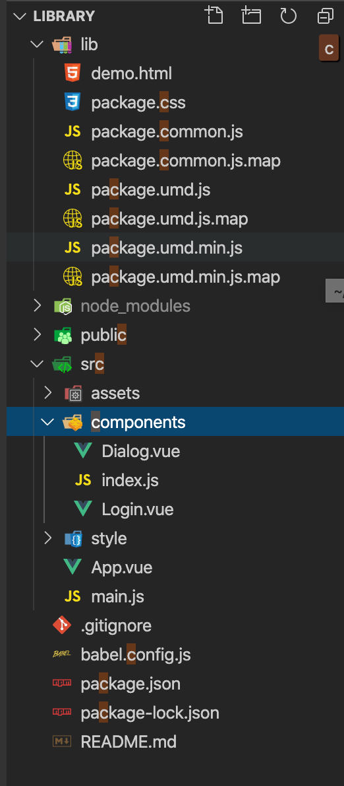

## 基于vue-cli3封装组件上传GitHub，项目中使用
### 1.组件封装
- 1.使用`vue create <project-name>` 创建项目
    <a href="https://cli.vuejs.org/zh/guide/creating-a-project.html" target='_blank'>vue-cli</a>
- 2.在component文件夹下,封装组件(这里封装了一个简单的`Dialog`组件)
```vue
<template>
    <div class="dialog" v-show="dialogIsShow">
        <div class="dialog-content" :style="{width:innerWidth+'%'}">
            <div class="dialog-header">
                <h3 class="title">{{title}}</h3>
                <span class="close" @click="cancelBtn">x</span>
            </div>
            <div class="dialog-body">
                <slot name="content"></slot>
            </div>
            <div class="dialog-footer">
                <a href="javascript:;" class="cancel" @click="cancelBtn">取消</a>
                <a href="javascript:;" class="submit" @click="submitBtn">确定</a>
            </div>
        </div>
    </div>
</template>
<script>
export default {
    name:"Dialog",
    props:{
        dialogVisible:{
            type:Boolean,
            default:false
        },
        title:{
            type:String,
            default:'提示'
        },
        innerWidth:{
            type:Number,
            default:30
        }
    },
    watch:{
        'dialogVisible'(newVal){
            this.dialogIsShow = newVal;
        }
    },
    data(){
        return{
            dialogIsShow:this.dialogVisible
        }
    },
    methods:{
        cancelBtn(){
            this.dialogIsShow = false;
            this.$emit('onCancel',false)
        },
        submitBtn(){
            // this.dialogIsShow = false;
            this.$emit('onSubmit',false)
        }
    }
}
</script>
<style lang="less" scoped>
.dialog{
    width: 100%;
    height: 100%;
    background: rgba(0, 0, 0, .2);
    .dialog-content{
        background: #fff;
        position: absolute;
        top:50%;
        left: 50%;
        transform: translate(-50%,-50%);
        .dialog-header{
            padding:20px 20px 10px;
            display: flex;
            justify-content:space-between;
            .title{
                padding: 0;
                margin: 0;
                font-weight: 400;
                font-size: #303133;
            }
            .close{
                color:#666;
                cursor: pointer;
            }
        }
        .dialog-body{
            padding:30px 20px;
        }
        .dialog-footer{
            display: flex;
            justify-content: flex-end;
            padding:10px 20px 20px;
            a{
                text-decoration: none;
                color:#606266;
                &.cancel,&.submit{
                    padding:10px 20px;
                    border:1px solid #dcdfe6;
                    margin:0 8px;
                }
                &.submit{
                    background: #409eff;
                    color:#fff;
                }
            }
        }
    }
}
</style>

```
- 3.在component文件夹下,新建一个`index.js`文件
```js
import Dialog from './Dialog.vue';
import ComponentName from './ComponentName.vue';
const components = [
    Dialog,
    ComponentName
]
const install = function(Vue){
    components.forEach(component=>{
        Vue.component(component.name,component)
    })
}
if(typeof window !== 'undefined' && window.Vue){
    install(window.Vue)
}
export default{
    install,
    ...components
}
```
- 4.在package.json文件，script添加命令行，方便构建
```js
"scripts":{
    "lint-build": "vue-cli-service build --target lib --name package --dest lib ./src/components/index.js"
}
```
1. --name 后面是你想要生成文件的名字
2. --dest lib修改改建的目录
#### 最重要的是
在package.json文件配置main
```js
"main": "lib/package.umd.js",
```
1. 这里配置的路径和上面配置的文件名一致

### 2.构建
- 1.执行`package.json`文件中的命令
`npm run lint-build`
- 2.会自动在根目录创建一个已你生成的名字的目录

<br />
<br />


### 3.上传到GitHub上
### 4.在项目中使用

- 1.在`package.json`的`dependencies`中
```js
"dependencies": {
    "library": "git@github.com:Crayon-F/library.git#v1.0"
},
```

- `library`:引入组件名称
- `git@github.com:Crayon-F/library.git#v1.0`:组件GitHub地址

- 2.在main.js中引用
```js
import 'library/lib/package.css'
import library from 'library'
Vue.use(library)
```
- 3.使用`library`中封装的组件
```vue
<template>
    <div id="app">
        <Dialog></Dialog>
    </div>
</template>
```
<p><a href="https://github.com/Crayon-F/library" target='_blank'>library地址</a></p>


