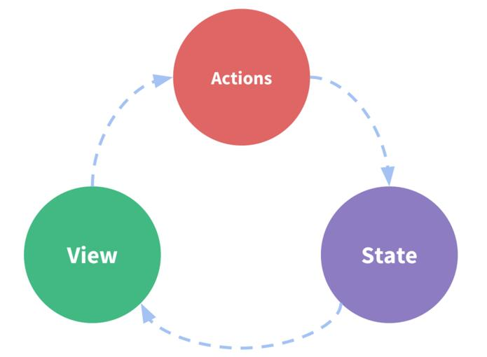
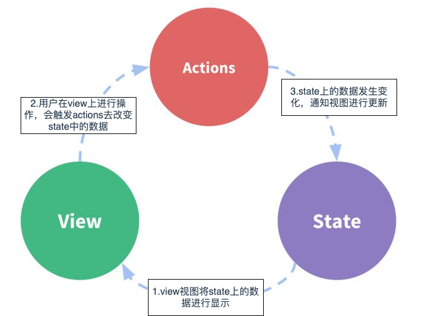
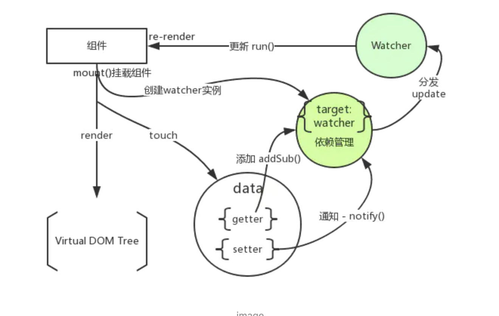
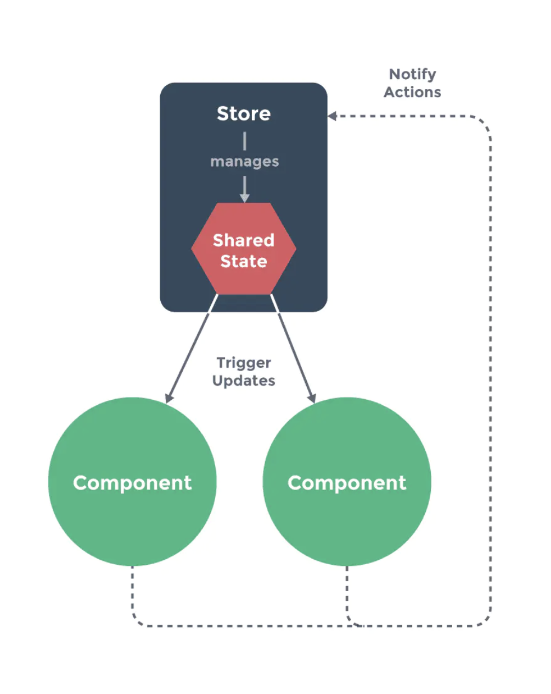
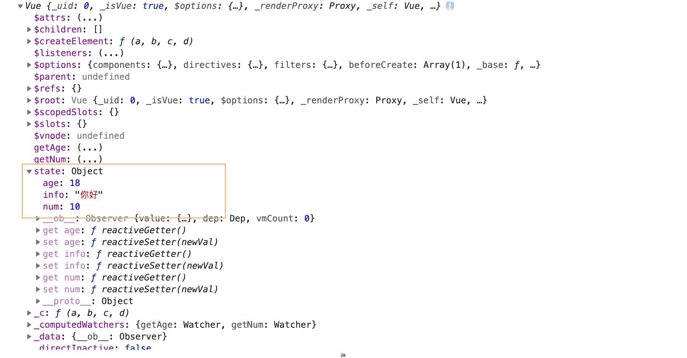
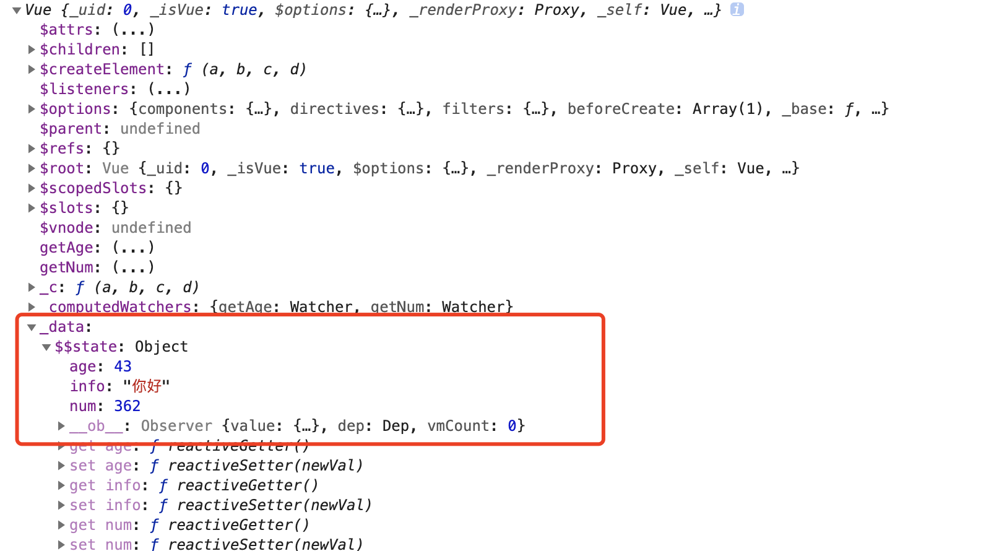

## 1.为什么要使用vuex
 ### 1.单项数据流
 <div style='text-align: center;'>
  
 </div>

 <br />
 <br />

 - state，驱动应用的数据源；
 - view，以声明方式将 state 映射到视图； 
 - actions，响应在 view 上的用户输入导致的状态变化。(比如请求数据或者修改数据会导致数据源状态改变)  
### 2. 问题
 - 当我们的应用遇到多个组件共享状态时，单向数据流的简洁性很容易被破坏：
  1. 多个视图依赖于同一状态。
  2. 来自不同视图的行为需要变更同一状态。
- 解决  
  1. 对于问题一，传参的方法对于多层嵌套的组件将会非常繁琐，并且对于兄弟组件间的状态传递无能为力。
  2. 对于问题二，我们经常会采用父子组件直接引用或者通过事件来变更和同步状态的多份拷贝。以上的这些模式非常脆弱，通常会导致无法维护的代码。

- 思考

  我们为什么不把组件的共享状态抽取出来，以一个**全局单例模式**(惰性单例的设计模式)管理，在这种模式下，我们的组件树构成了一个巨大的“视图”，不管在树的哪个位置，任何组件都能获取状态或者触发行为！

  通过定义和隔离状态管理中的各种概念并通过强制规则维持视图和状态间的独立性，我们的代码将会变得更结构化且易维护。


## 2.什么是vuex
### 1.概念
  Vuex 是专门为 Vue.js 设计的状态管理库，它采用**集中式存储管理应用**的所有组件的状态。
### 2.“状态管理模式”？
- 为什么进行状态管理
<p>随着 JavaScript 单页应用开发日趋复杂，JavaScript 需要管理比任何时候都要多的 state （状态）。 这些 state 可能包括服务器响应、缓存数据、本地生成尚未持久化到服务器的数据，也包括 UI 状态，如激活的路由，被选中的标签，是否显示加载动效或者分页器等等。</p>
<p>管理不断变化的 state 非常困难。如果一个 model 的变化会引起另一个 model 变化，那么当 view 变化时，就可能引起对应 model 以及另一个 model 的变化，依次地，可能会引起另一个 view 的变化。直至你搞不清楚到底发生了什么。state 在什么时候，由于什么原因，如何变化已然不受控制。 当系统变得错综复杂的时候，想重现问题或者添加新功能就会变得举步维艰。<br />
-- 摘自《Redux 中文文档》</p>
<p>Vuex 是一个专为 Vue.js 应用程序开发的状态管理模式。它采用集中式存储管理应用的所有组件的状态，并以相应的规则保证状态以一种可预测的方式发生变化。<br/>
-- -- 摘自《vuex 官网》 </p>
<br />
<div style='text-align: center;'>
  
</div>
 <br />
 <br />

 - 1.view视图将state上的数据进行显示
 - 2.用户在view上进行操作，会触发actions去改变state中的数据
 - 3.state上的数据发生变化，通知视图进行更新

1. 在Vue或React中我们暂时不用关心1，3步骤，因为框架的核心就是实现双向数据绑定
<div style='text-align: center;'>
  
</div>
2. 步骤2是我们参与的部分，也就是状态管理的部分

既然我们不暂时不用关心view层是如何进行双向绑定以及视图渲染，那我们为什么不把**状态管理**和**view层**进行代码分开，
分开的好处是不依赖视图，随时可以换掉view层，而不用修改状态管理的部分代码


- 什么是状态管理

```js
new Vue({
  // state
  data () {
    return {
      count: 0
    }
  },
  // view
  template: `
    <div>{{ count }}</div>
  `,
  // actions
  methods: {
    increment () {
      this.count++
    }
  }
})
```
::: tip
随着 JavaScript 单页应用开发日趋复杂，JavaScript 需要管理比任何时候都要多的 state （状态）。 这些 state 可能包括服务器响应、缓存数据、本地生成尚未持久化到服务器的数据，也包括 UI 状态，如激活的路由，被选中的标签，是否显示加载动效或者分页器等等。
:::
- 这是一个状态自管理应用,以这样理解，state，view，action，三部分都写在了组件内，状态由应用组件各自管理，即自己的状态自己管理。

- 而我们常说的状态管理，往往是指外部管理，目的是对状态和组件进行分离，
  具体到 Vuex 里的表现就是：**把应用的所有组件的状态抽取出来，以一个全局单例模式在应用外部采用集中式存储管理。**

- 状态管理其实就是把内部对 state 部分的操作，都拿到外部去了
- 在Vue中，Vue 的核心库只关注视图层，单文件组件，其模板、逻辑和样式是内部耦合的，侧重数据和视图的同步；Vue 本身并没有对数据状态的管理进行处理，但其提供了另外一个解决方案 Vuex，一个集中式状态管理的库；也就是说，你可能不需要 Vuex，它只是对你应用状态进行管理的一个库。

## 3.vuex的基本用法
<br />
<div style='text-align: center;'>
  
</div>
<br />
<br />

**Vuex为Vue Components建立起了一个完整的生态圈，包括开发中的API调用一环。**

- state：存储数据，存储状态；在根实例中注册了store 后，用 this.$store.state 来访问；对应vue里面的data；存放数据方式为响应式，vue组件从store中读取数据，如数据发生变化，组件也会对应的更新。
- getter：可以认为是 store 的计算属性，它的返回值会根据它的依赖被缓存起来，且只有当它的依赖值发生了改变才会被重新计算。
- mutation：状态改变操作方法。是Vuex修改state的唯一推荐方法，其他修改方式在严格模式下将会报错。该方法只能进行同步操作，且方法名只能全局唯一。操作之中会有一些hook暴露出来，以进行state的监控等。
- action：操作行为处理模块。负责处理Vue Components接收到的所有交互行为。包含同步/异步操作，支持多个同名方法，按照注册的顺序依次触发。向后台API请求的操作就在这个模块中进行，包括触发其他action以及提交mutation的操作。该模块提供了Promise的封装，以支持action的链式触发。
- module：将 store 分割成模块，每个模块都具有state、mutation、action、getter、甚至是嵌套子模块。
- dispatch：操作行为触发方法，是唯一能执行action的方法。
- Vue Components：Vue组件。HTML页面上，负责接收用户操作等交互行为，执行dispatch方法触发对应action进行回应。
- commit：状态改变提交操作方法。对mutation进行提交，是唯一能执行mutation的方法。

**基本使用**

- store>>index.js
```js
import Vue from 'vue'
import Vuex from 'vuex'

Vue.use(Vuex)
const SET_AGE = 'SET_AGE'
export default new Vuex.Store({ //内部会创造一个vue实例
  state: { //组件的状态，可以理解new Vue(data)
    age:18
  },
  getters:{ //相当于计算属性,new Vue(computed) ,当依赖的值变化时会重新执行
    getAge(state){ //如果返回的结果相同，不会执行
      return state.age + 10
    }
  },
  //vue中的方法，唯一可以更改状态的方法
  mutations: { 
    // payload称之为载荷，唯一更改state的状态的方式，并且是同步
    [SET_AGE](state,payload){
      state.age += payload
    }
  },
  actions: { //异步方式
    changeAge({
        commit
      }, payload) {
      setTimeout(() => {
        commit('SET_AGE', payload)
      }, 3000);
    }
  },

})
```
- main.js
```js
import Vue from 'vue'
import App from './App.vue'
import store from './store'

Vue.config.productionTip = false

new Vue({
  store,
  render: h => h(App)
}).$mount('#app')
```
- 组件App.vue
```js
 <template>
  <div id="app">
    <p>我的年龄:{{$store.state.age}}</p>
    <p>计算属性之后的年龄:{{$store.getters.getAge}}</p>
    <button @click="$store.commit('SET_AGE',10)">更改年纪</button>
    <button @click="$store.dispatch('changeAge',5)">异步更改年纪</button>
  </div>
</template>
```
- 把组件的共享状态抽取出来，以一个全局单例模式管理。
- 在这种模式下，我们的组件树构成了一个巨大的“视图”，不管在树的哪个位置，任何组件都能获取状态或者触发行为
- 通过定义和隔离状态管理中的各种概念并强制遵守一定的规则，我们的代码将会变得更结构化且易维护。
<div style='text-align: center;'>
    
</div>

### 注意：
- 组件不允许直接修改属于 store 实例的 state，而应执行 action 来分发 (dispatch) 事件通知 store 去改变，action 提交的是 mutation，而不是直接变更状态。mutation可以直接变更状态。
- action 可以包含任意异步操作。mutation只能是同步操作
- mutation第一个参数是state，而action第一个参数是context，其中包含了
```js
{
    state,      // 等同于 `store.state`，若在模块中则为局部状态
    rootState,  // 等同于 `store.state`，只存在于模块中
    commit,     // 等同于 `store.commit`
    dispatch,   // 等同于 `store.dispatch`
    getters,    // 等同于 `store.getters`
    rootGetters // 等同于 `store.getters`，只存在于模块中
}

```
- 在带命名空间的模块内提交全局的mutation和action，将 `{ root: true }` 作为第三参数传给 dispatch 或 commit。
```js
this.$store.dispatch('actionA', null, { root: true })
this.$store.commit('mutationA', null, { root: true })
```
- 带命名空间的模块内注册全局的action
```js
actions: {
  actionA: {
      root: true,
      handler (context, data) { ... }
  }
}
```
<a target='_blank' href='https://vuex.vuejs.org/zh/'>官网</a><br />
<a target='_blank' href='https://juejin.im/post/6844903937745616910#heading-15'>详细使用</a><br />
<a target='_blank' href='https://juejin.im/post/6844903993374670855'>注意点</a><br />
<a target='_blank' href='https://github.com/Crayon-F/vuex-init'>代码示例</a>

## 4.什么时候使用vuex？
**官方：**<br />
**Vuex 是一个专为 Vue.js 应用程序开发的状态管理模式。它采用集中式存储管理应用的所有组件的状态，并以相应的规则保证状态以一种可预测的方式发生变化。**
<br />
**民间：**<br />
**鲁迅说: --当你无法很好进行数据管理的时候，你才需要用Vuex**
### 1.当一个组件需要多次派发事件时
- 1.当一个组件多次多次派发事件,必然有其它组件进行接收并调用。
  - 如果是一个组件进行接收和调用还好,但是多个组件进行接收？
  - 派发事件的组件如果只派发一个事件,那还比较好管理,一旦进行多次派发那么维护的难度会以乘法增加
  - 案例（购物车）
    - 派发：
      - 在首页、分类、商品详情页添加商品需要触发一次
      - 在购物车进入编辑状态,删除购物车项,需要触发一次 
      - 在结算订单时,需要触发一次
    - 接收
      - 如果每次都调用获取购物车数量的接口,但是每一次的HTTP请求,都是对浏览器性能消耗。
- 解决：
  - 将数据存在vuex中，派发时调用action，接收时获取store
### 2.跨组件共享数据、跨页面共享数据
- 1.当多个组件同时共享数据，跨组件通信
  - 案例（登录）
      - 用户点击登录按钮，登录成功，触发vuex中action，将用户信息进行可持续存储
      - 当其他页面（跨组件通信）用到当前用户是否登录信息，进行相应展示活操作

## 4.封装一个vuex
- 入口
```js
import Vue from 'vue'
import Vuex from 'vuex'
Vue.use(Vuex)
export default new Vuex.Store({ 
  state: { 
  },
  getters:{ 
  },

  mutations: {
  },
  actions: {
  },
})

```
- 引入vuex，并且vuex中有一个Store实例
- 通过vue.use(vuex),说明我们有一个`install`方法
### 1.初始化
1. 新建一个store文件，有一个index.js用来初始化配置
- index.js
```js
import {Store,install} from './store';

export default{
  Store,
  install
}

export {
  Store,
  install
}

// 两种方式导出方式

```
### 2.install方法
1. 新建一个store.js,用来书写我们Store和install
- 首先写install方法
```js
import {
  applyMixin
} from './applyMixin'

let Vue;
class Store{
  constructor(options){

  }
    
}
const install = (_Vue)=>{
  Vue = _Vue;
  // 我们可以在组件中使用store，
  //将store混入到vue中，在全局进行注册，
  applyMixin(Vue)
  // console.log('install', Vue)
}
export {
  Store,
  install
}
```
- 1.既然我们在跟组件和每个组件中都能拿到$store实例，所以我们需要写一个混入mixin方法
- 2.我们写一个applyMixin方法，并将vue传入
```js
const applyMixin = (Vue)=>{
  //在根组件创建前都会执行vuexInit初始化，将store注入进去
  Vue.mixin({
    beforeCreate:vuexInit
  })
}
function vuexInit() {
  // 给组件都注册一个$store属性，指向同一个，所有组件都共用一个store
  // this.$options当前组件实例的属性
  // 获取创建vue实例时配置的选项
  // console.log(this.$options)
  const options = this.$options;
  // 组件的创建过程，先父后子
  if(options.store){
    // 根实例
    this.$store = options.store
  } else if (options.parent && options.parent.$store) {
    this.$store = options.parent.$store
  }
}
export {
  applyMixin
}
```
- 在当前组件创建前`beforeCreate`钩子函数调用一个`vuexInit`方法
- `vuexInit`中拿到当前vue实例中的$options
- 进行判断，因为根组件已经注册进`store`,所有如果当前组件$options有store，即是根组件
- 如果当前组件`options.parent`并且 `options.parent.$store`,我们进行挂载
- 这是可以在new Vue和子组件内部都可以拿到`$store`
### 3.new Store添加属性
1. state
```js
import {
  applyMixin
} from './applyMixin'
let Vue;
class Store{
  constructor(options){
    // 1.state
    let state = options.state; //用户传过的状态
    // 1.不能直接将state定义在实例上，因为我们state中的值是需要改变的，如果直接定义在实例上视图是不能直接更新的
    // this.state = options.state;
    // 2.所以我们采用new Vue将state绑定在data上，这样就会触发vue中的observe方法，从而收集watcher，进行视图更新
    // 这也是为什么vuex跟vue是进行强依赖的

    // 在vue中定义数据的时候，是有特点的，如果属性名是以$xxx命名，是不会代理到vue实例中
    this._vm = new Vue({
      data:{
        // state: state
        // 在vuex源码中是使用$$,表示内部状态
        $$state:state
      },
    })
    //console.log(this._vm.state) //如果不以$xxx命名，是直接可以从实例拿到
    // console.log(this._vm) //
  }
  // 类的属性访问器，当用户去这个实例上去拿state属性时，会执行此方法
  get state(){
    return this._vm._data.$$state
  }
  
}
const install = (_Vue)=>{
  Vue = _Vue;
  // 我们可以在组件中使用store，
  //将store混入到vue中，在全局进行注册，
  applyMixin(Vue)
}
export {
  Store,
  install
}
```
- 1. 不能直接将state定义在实例上，因为我们state中的值是需要改变的，如果直接定义在实例上视图是不能直接更新的
- 2. 所以我们采用new Vue将state绑定在data上，这样就会触发vue中的observe方法，从而收集watcher，进行视图更新，这也是为什么vuex跟vue是进行强依赖的
- 3. 在vue中定义数据的时候，是有特点的，如果属性名是以$xxx命名，是不会代理到vue实例中
  - `state:state`
  <br />
  
  - `$$state:state`
  <br />
  
 
- 4. `get state(){
    return this._vm._data.$$state
  }`类的属性访问器，当用户去这个实例上去拿state属性时，会执行此方法

2. getters
- 封装`forEach`方法
```js
export function forEach(obj = {}, cb) {
  Object.keys(obj).forEach((key)=>cb(obj[key],key))
}
// forEach({name:'小名',age:18},(val,key)=>{
//   console.log(val, key)
// })
```
```js
import {
  applyMixin
} from './applyMixin'
import {
  forEach
} from './util'
let Vue;
class Store{
  constructor(options){
    // 1.state
    let state = options.state; //用户传过的状态
    // 1.不能直接将state定义在实例上，因为我们state中的值是需要改变的，如果直接定义在实例上视图是不能直接更新的
    // this.state = options.state;
    // 2.所以我们采用new Vue讲state绑定在data上，这样就会触发vue中的observe方法，从而收集watcher，进行视图更新
    // 这也是为什么vuex跟vue是进行强依赖的


    // 2.getter
    //getter 其实写的是方法，但是取值的是属性
    //所以我们使用Object.defineProperty
    this.getters = {};

    // 这样写是没有缓存效果，一旦页面中的取值发生变换，都会进行重新执行渲染
    // forEach(options.getters,(fn,key)=>{
    //   Object.defineProperty(this.getters, key, {
    //     get:()=>fn(state)
    //   })
    // })

    // 在vue中我们computed是具有缓存效果
    // computed里面的值也是一个个的方法
    const computed = {};
    forEach(options.getters, (fn, key) => {
      computed[key] = ()=>{
        return fn(state)
      }
      // this.getters[key] = ()=>this._vm[key]
      Object.defineProperty(this.getters, key, {
        get:()=>this._vm[key]
      })
    })
    

    // 在vue中定义数据的时候，是有特点的，如果属性名是以$xxx命名，是不会代理到vue实例中
    this._vm = new Vue({
      data:{
        // state: state
        // 在vuex源码中是使用$$,表示内部状态
        $$state:state
      },
      computed //计算属性会将自己的属性直接放在实例上,也就是说我们可以直接this._vm.getAge
    })
    console.log(this._vm) //如果不以$xxx命名，是直接可以从实例拿到
    // console.log(this._vm) //
  }

  // 类的属性访问器，当用户去这个实例上去拿state属性时，会执行此方法
  get state(){
    return this._vm._data.$$state
  }
  
}
const install = (_Vue)=>{
  Vue = _Vue;
  // 我们可以在组件中使用store，
  //将store混入到vue中，在全局进行注册，
  applyMixin(Vue)
  console.log('install', Vue)
}
export {
  Store,
  install
}
```
- 1. getters其实写的是方法，但是取值的是属性
- 2. getters是具有缓存效果，所有需要利用vue中的computed实现缓存

3. mutations和actions
```js
import {
  applyMixin
} from './applyMixin'
import {
  forEach
} from './util'
let Vue;
class Store{
  constructor(options){
    // 1.state
    let state = options.state; //用户传过的状态
    // 1.不能直接将state定义在实例上，因为我们state中的值是需要改变的，如果直接定义在实例上视图是不能直接更新的
    // this.state = options.state;
    // 2.所以我们采用new Vue讲state绑定在data上，这样就会触发vue中的observe方法，从而收集watcher，进行视图更新
    // 这也是为什么vuex跟vue是进行强依赖的


    // 2.getter
    //getter 其实写的是方法，但是取值的是属性
    //所以我们使用Object.defineProperty
    this.getters = {};

    // 这样写是没有缓存效果，一旦页面中的取值发生变换，都会进行重新执行渲染
    // forEach(options.getters,(fn,key)=>{
    //   Object.defineProperty(this.getters, key, {
    //     get:()=>fn(state)
    //   })
    // })

    // 在vue中我们computed是具有缓存效果
    // computed里面的值也是一个个的方法
    const computed = {};
    forEach(options.getters, (fn, key) => {
      computed[key] = ()=>{
        return fn(state)
      }
      Object.defineProperty(this.getters, key, {
        get:()=>this._vm[key]
      })
    })
    

    // 在vue中定义数据的时候，是有特点的，如果属性名是以$xxx命名，是不会代理到vue实例中
    this._vm = new Vue({
      data:{
        // state: state
        // 在vuex源码中是使用$$,表示内部状态
        $$state:state
      },
      computed //计算属性会将自己的属性直接放在实例上,也就是说我们可以直接this._vm.getAge
    })
    console.log(this._vm) //如果不以$xxx命名，是直接可以从实例拿到
    // console.log(this._vm) //


    // 3.mutations
    // 采用了发布订阅模式，将用户定义的mutation和action先保存起来，然后当调用commit的时候我们调用mutations方法
    // 调用dispatch时候我们调用action的方法
    this._mutations = {}
    forEach(options.mutations, (fn, key) => {
      this._mutations[key] = (playload) => fn.call(this,state, playload)
    })

    // 4.actions
    // 采用了发布订阅模式，将用户定义的mutation和action先保存起来，然后当调用commit的时候我们调用mutations方法
    // 调用dispatch时候我们调用action的方法
    this._actions = {}
    forEach(options.actions, (fn, key) => {
      this._actions[key] = (playload) => fn.call(this, this, playload)
    })
  }

  // 类的属性访问器，当用户去这个实例上去拿state属性时，会执行此方法
  get state(){
    return this._vm._data.$$state
  }

  // commit的方法
  commit = (type, playload) => {
    this._mutations[type](playload)
  }
  dispatch = (type, playload)=>{
    this._actions[type](playload)
  }
  
}
const install = (_Vue)=>{
  Vue = _Vue;
  // 我们可以在组件中使用store，
  //将store混入到vue中，在全局进行注册，
  applyMixin(Vue)
  console.log('install', Vue)
}
export {
  Store,
  install
}
```
- 1. 采用发布订阅模式，将用户定义的mutation和action先保存起来，然后当调用commit的时候我们调用mutations方法，调用dispatch时候我们调用action的方法

## 项目中vuex问题

 示例(改正的样子，比不使用的优点)

 ---------------------------------------------------------------------------------------------------
 参考资料：<br />
<a target='_blank' href='https://vuex.vuejs.org/zh/'>vuex官网</a><br />
<a target='_blank' href='https://juejin.im/post/6844903937745616910#heading-15'>[Vuex]Vuex学习手记</a><br />
<a target='_blank' href='https://juejin.im/post/6844903993374670855'>Vuex面试题汇总</a><br />
<a target='_blank' href='https://blog.csdn.net/weixin_36774307/article/details/87716169'>什么时候使用vuex</a>
